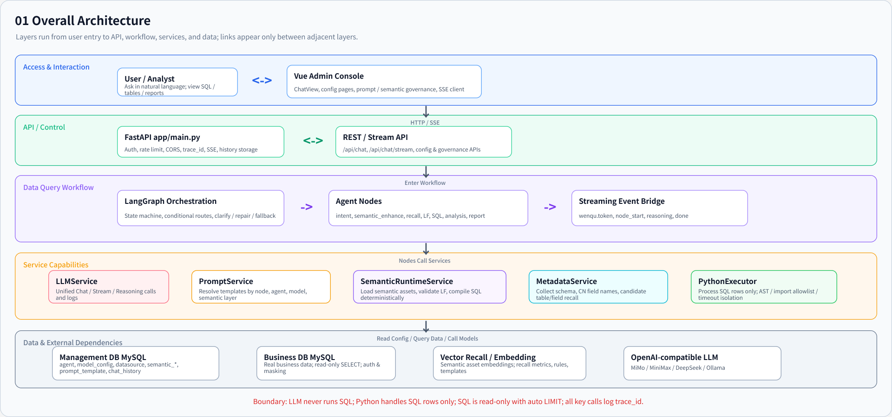
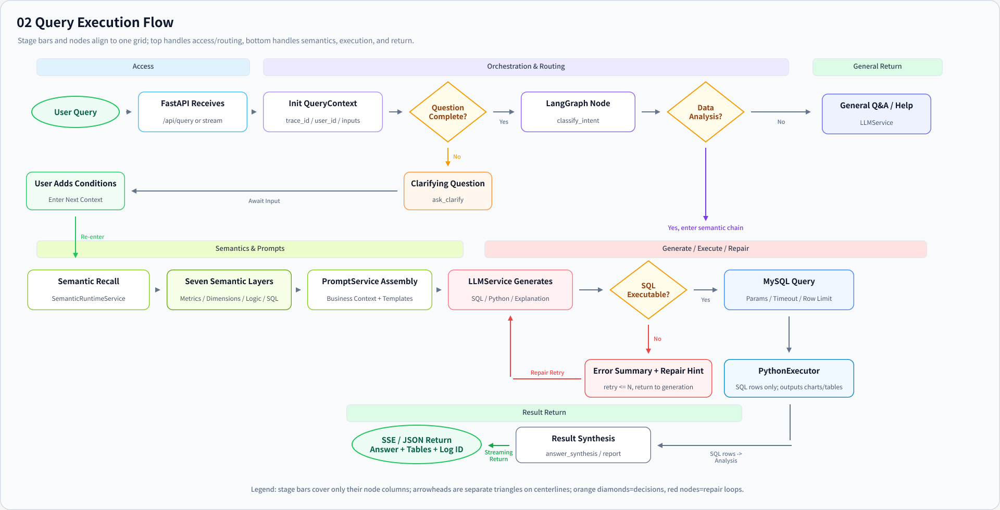
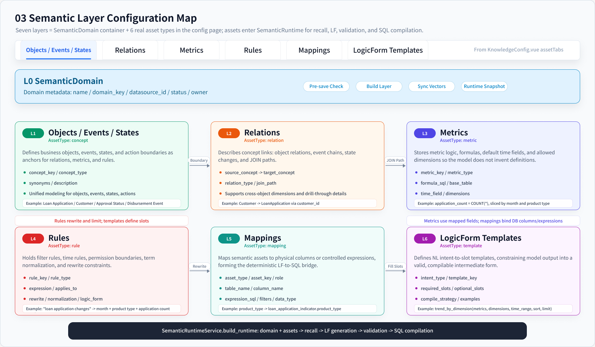
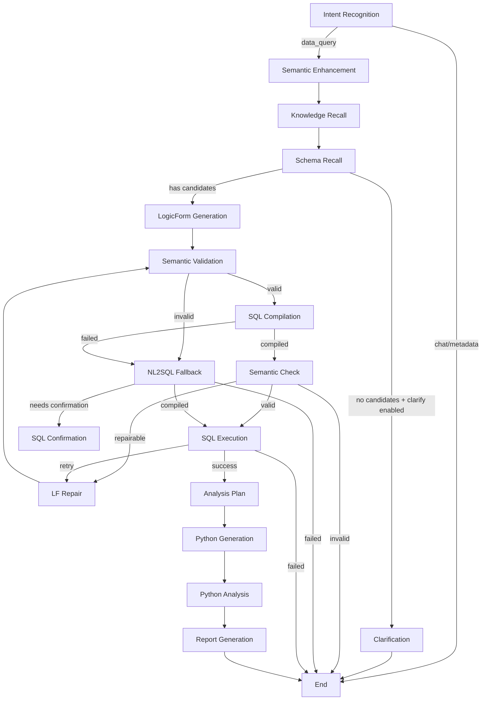
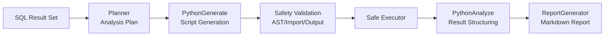
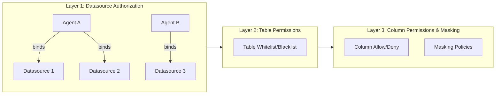
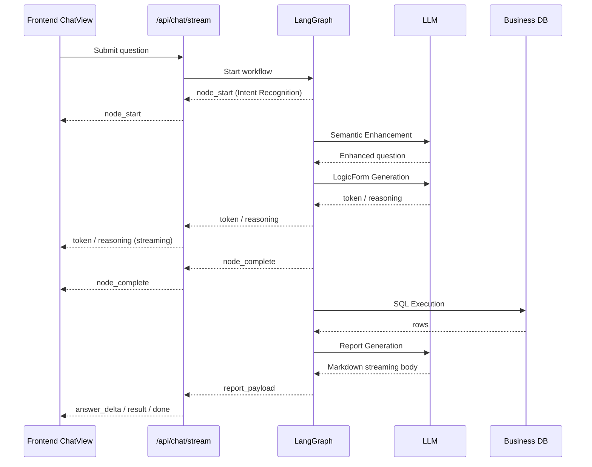

# WenQu Ontology-Driven Enterprise Operational Digital Twin & Decision Platform

English | [中文](./README_CN.md)

> Turn enterprise business definitions and distributed data into a unified model that AI can understand, query, evaluate, act on, and trace. Finance/tax, lending, and other vertical agents consume this platform as shared infrastructure.


---

## Table of Contents

- [Product Focus](#product-focus)
- [Features](#features)
- [Architecture](#architecture)
- [Quick Start](#quick-start)
- [Detailed Documentation](#detailed-documentation)
  - [Core Workflow](#1-core-workflow)
  - [Enterprise Business Model](#2-enterprise-business-model)
  - [Deep Analysis (Phase 3)](#3-deep-analysis-phase-3)
  - [Security](#4-security)
  - [Streaming & Frontend](#5-streaming--frontend)
  - [API Overview](#6-api-overview)
  - [Configuration](#7-configuration)
  - [Database Design](#8-database-design)
  - [Logging & Observability](#9-logging--observability)
  - [Development Guide](#10-development-guide)
- [Examples](#examples)
- [Roadmap](#roadmap)
- [Contributing](#contributing)
- [License](#license)

---

## Product Focus

WenQu aims to become an enterprise **intelligence hub and decision engine**. It connects business experts' understanding of the company with data from databases, APIs, files, and business events to build an operational digital twin that AI agents can consume through governed capabilities.

This is not a 3D simulation or a copy of a database. The target platform has three core parts:

1. **Enterprise Model Center** unifies objects, relationships, metrics, rules, states, actions, data mappings, permissions, and versions. Query semantics and Ontology modeling become one product model.
2. **Data Processing and Twin Runtime** maps physical records to identified business objects and maintains their current state, provenance, and eventually their state history.
3. **Capability Publishing Center** exposes object queries, metric computation, decisions, and governed actions to agents and applications through stable contracts.

```text
Databases / APIs / files / business events
        -> Enterprise model and twin runtime
        -> Query / Decision / Action Capability
        -> Finance & tax agent / lending agent / business applications
        -> Feedback and decision audit
```

Finance/tax report delivery, lending risk, and conversational querying are vertical applications and validation scenarios, not the final boundary of the platform. Chat currently demonstrates and validates the foundation rather than defining the product roadmap.

### Capability Boundary as of 2026-09-03

| Status | Scope |
|--------|-------|
| **Implemented foundation** | Query-semantic assets, Ontology object/link/action modeling, LogicForm and deterministic SQL, object instances, release/audit prototypes, and demonstrable conversational analysis/reporting |
| **Implemented technical slice** | Object queries, the first Query Capability, governed Action tools, plus a lending-domain risk/evidence/review/report/decision-audit loop |
| **Implemented P0 compatibility skeleton** | A default enterprise space and domain ownership model, Agent-domain many-to-many binding, a unified Enterprise Model entry, and pages that surface existing twin-runtime and capability APIs |
| **Future work** | Production incremental sync/CDC, identity resolution, state history, data quality and lineage, formal capability release governance, reusable Decision Capabilities, and reliable external-system writeback |

The loan-risk domain is currently used only to validate the technical workflow. Its sample data, thresholds, rules, and conclusions are synthetic and must not be treated as real lending, finance, tax, accounting, audit, or compliance advice.

See [Current Business Direction, Product Flow, and Data Lineage](docs/product-business-flow.md) for the operating model and the [Ontology Product Roadmap](docs/ontology-product-roadmap.md) for platform evolution.

---

## Features

### Enterprise Model Center

Model objects, properties, relationships, events, states, and actions together with concepts, metrics, rules, physical mappings, and LogicForm query contracts. Query Semantics and Ontology Modeling are no longer treated as independent product assets. Their storage can remain compatible during migration, but domain ownership, stable object keys, releases, and the user entry point are unified.

### Data Processing and Twin Runtime

Map database records into Ontology object instances while keeping source properties separate from local action overlays. Read-only object synchronization and instance queries already exist through page/API triggers, and P0 provides a unified runtime entry. Scheduled incremental sync, CDC, cross-system identity resolution, complete state history, and production data-quality governance remain future work.

### Capability Publishing Center

Expose the model as standard capabilities for agents and applications. `Query Capability` handles read-only object queries and metrics, `Action Capability` handles governed side effects, and future `Decision Capability` contracts will handle rule/model evaluation. Object query, a first Query Capability, and Action tools already exist; P0 centralizes discovery and invocation without claiming a production capability gateway.

### Risk Report Delivery Loop (Vertical Technical Slice)

The loan technical slice now connects structured risk issues, traceable evidence, human review, versioned reports, controlled Ontology actions, and hash-chained audit through migrations, APIs, a workbench, synthetic demo assets, and automated replay. Real finance/tax rules, roles, and report templates still require internal business validation.

Completed query results in Chat can be converted directly into risk issues. The platform resolves the exact turn by `trace_id`, then freezes the question, LogicForm, SQL, result preview, and bounded analysis summary as query/metric evidence. Selecting an Ontology object adds an immutable object snapshot, so users no longer need to copy query evidence manually.

### Business Ontology Foundation

Model the business through object types, properties, relationships, states, and governed actions. Validate and publish model versions, manage instances and permissions, and retain runtime audit records for shared use by data, AI agents, reports, and applications. Ontology is an enterprise asset, not private configuration owned by one Agent.

### Governed AI Data Querying

Natural-language questions are grounded in enterprise objects, relationships, and governed business definitions before schema recall, SQL generation, query execution, statistical analysis, and reporting. Multi-turn context, follow-ups, and corrections remain supported.

### Governed Actions and Decision Audit

Actions are part of the Ontology model, with explicit parameters, preconditions, roles, approval requirements, and state effects. Object updates, action-run records, and unified audit events commit atomically; risk issues, evidence, reviews, report versions, and actions share an append-only hash chain with a persisted head anchor.

### Deep Analysis & Reporting

SQL results are automatically fed into a Python sandbox for statistical analysis (distribution, trend, ranking, anomaly detection), then a structured Markdown report of at least 300 Chinese characters is generated with charts and data interpretation.

### Multi-Agent / Multi-Datasource / Multi-Model

Create multiple agents with different models, datasources, and authorized domains. The target relationship is asset-first: a published business domain can be reused by multiple agents and applications, while one agent can consume multiple authorized domains. A compatibility layer preserves existing agent-scoped query behavior during migration.

### Security

- JWT authentication with role-based access (admin / regular user)
- SQL safety validation (single read-only SELECT, dangerous keyword interception, LIMIT injection)
- Three-layer permission control (datasource authorization, table whitelist, column masking)
- Python executor isolation (AST validation, import whitelist, resource limits, containerization)
- Datasource passwords and model API keys encrypted at rest

### Streaming Interaction

Real-time SSE (Server-Sent Events) output lets users observe node execution progress, model reasoning, and intermediate results.

### Configurability

Prompt templates can be overridden per agent, model, and semantic domain. System parameters support runtime tuning of recall thresholds, executor settings, and more.

---

## Architecture

### System Architecture



The current foundation combines Ontology/query-semantic assets, datasources and schema metadata, an object-instance runtime, typed capability APIs, conversational querying, a FastAPI backend, LangGraph workflows, and external dependencies (LLM, MySQL, Milvus). P0 adds an enterprise-space/domain compatibility skeleton plus unified Enterprise Model, Twin Runtime, and Capability Center entries. These visible entries must not be confused with a production twin runtime or capability gateway.

### Query Execution Flow



Full pipeline: User question → Intent Recognition → Semantic Enhancement → Knowledge Recall → Schema Recall → LogicForm Generation → Semantic Validation → SQL Compilation → Semantic Consistency Check → SQL Execution → Analysis Plan → Python Generation → Python Analysis → Report Generation.

### Enterprise Business Model



The Enterprise Business Model puts two complementary asset types under the same domain and release boundary: Ontology defines objects, links, states, and actions; query semantics add concepts, metrics, rules, mappings, and templates that connect the model to physical data and compilable queries. A unified product entry does not require an immediate rewrite of every underlying table.

---

## Quick Start

### Prerequisites

| Dependency | Version | Notes |
|------------|---------|-------|
| Python | >= 3.11 | Backend runtime |
| Node.js | >= 18 | Frontend build |
| MySQL | >= 8.0 | Business + management databases |
| Milvus | >= 2.5 | Vector database (optional, supports local Lite mode) |
| uv | Latest | Python package manager (recommended) |

### 1. Clone the Project

```bash
git clone https://github.com/<your-org>/wenqu-dataquery-agent.git
cd wenqu-dataquery-agent
```

### 2. Start Dependencies

Use Docker Compose to start MySQL and Milvus:

```bash
docker compose up -d
```

This starts:
- **MySQL 8.0** — Port 3306, auto-creates management database `dataquery_agent` with schema and sample data
- **Milvus 2.5** — Port 19530, local storage mode

### 3. Backend Setup

```bash
# Copy environment config
cp .env.example .env

# Edit .env — at minimum configure:
# - LLM_BASE_URL / LLM_API_KEY / LLM_MODEL (LLM)
# - EMBEDDING_BASE_URL / EMBEDDING_API_KEY / EMBEDDING_MODEL (embedding model)
# - MYSQL_* / MANAGEMENT_MYSQL_* (database connections, defaults work out of the box)

# Install Python dependencies
uv sync

# Start backend
uv run uvicorn app.main:app --host 0.0.0.0 --port 4400 --reload
```

The backend automatically runs database migrations on startup, creating management tables and seeding default configurations.

### 4. Frontend Setup

```bash
cd frontend
npm install
npm run dev
```

Frontend runs at `http://localhost:4399` by default (use the Network URL printed at startup for LAN access), backend API at `http://localhost:4400`.

### 5. Import Demo Data (Optional)

**Loan Risk domain:**

```bash
# Create demo tables and data
uv run python examples/loan/seed_loan_indicators.py

# Import semantic layer assets
uv run python scripts/import_semantic_bundle.py \
  --path examples/loan/semantic-domain.json \
  --agent-id 1 \
  --datasource-id 1
```

Note: In the demo environment, always pass `--agent-id 1 --datasource-id 1` explicitly. `import_semantic_bundle.py` only upserts semantic assets; it does not delete old `semantic_relation` records that are not present in the bundle. Remove obsolete relations separately and deliberately, after backing up and verifying the data.

The loan domain is a synthetic technical demo. Its rules and generated conclusions are not real lending or compliance opinions.

**Douyin E-commerce domain:**

```bash
uv run python examples/douyin_ecommerce/seed_douyin_ecommerce.py
```

### 6. Verify

Open `http://localhost:4399` with an administrator account and inspect:

- `/enterprise-model` for query-semantic and Ontology assets under one domain.
- `/twin-runtime` for object types, instance counts, and manual paginated synchronization.
- `/capability-center` for current object-query, Query Capability, and Action contracts.
- `/agent` to bind one or more business domains to an application agent and choose its default domain.

Then ask a question in Chat using an agent bound to the domain:

```
What are the top 3 application regions by loan count, and how many applications did each have?
```

Observe the node execution process, SQL generation, and final analysis report in the analysis pipeline.

---

## Detailed Documentation

### 1. Core Workflow

The query pipeline is orchestrated by a LangGraph StateGraph with 16 processing nodes:

| Node | File | Function | Calls LLM |
|------|------|----------|-----------|
| `intent_recognition` | `nodes/intent.py` | Intent classification: rule-based keywords + LLM fallback. Types: data_query/chat/metadata_query | Not always |
| `semantic_enhance` | `nodes/semantic_enhance.py` | Rewrites the original question into a clearer business query, filling in omitted metrics, dimensions, and TopN | Yes |
| `semantic_runtime_recall` | `nodes/semantic_runtime_recall.py` | Loads semantic assets, vector recall for relevant metrics, dimensions, and rules | Vector recall |
| `schema_recall` | `nodes/schema_recall.py` | Recalls candidate tables, columns, and JOIN hints from collected schema and semantic assets | No |
| `clarification` | `nodes/clarification.py` | Low-confidence clarification: when no candidate tables found, guides user to specify business object, time range, or metric | Yes |
| `nl2lf_generate` | `nodes/nl2lf_generate.py` | LogicForm generation: natural language → structured query intent (metrics/dimensions/filters/sort/limit) | Yes |
| `lf_validate` | `nodes/lf_validate.py` | Semantic validation: checks if metrics, dimensions, filters, and time ranges in the LogicForm are valid | No |
| `lf_repair` | `nodes/lf_repair.py` | LF repair: removes unsupported dimensions, unknown metrics, or unresolvable time ranges | No |
| `lf_to_sql_compile` | `nodes/lf_to_sql_compile.py` | SQL compilation: deterministically compiles LogicForm into MySQL SELECT | No |
| `nl2sql_fallback` | `nodes/nl2sql_fallback.py` | NL2SQL fallback: when semantic layer misses, LLM generates read-only SQL based on candidate schema | Yes |
| `semantic_check` | `nodes/analysis_pipeline.py` | Semantic consistency check: verifies compiled SQL faithfully represents the LogicForm | No |
| `sql_confirmation` | `nodes/human_confirm.py` | Execution confirmation: human-in-the-loop, waits for user to confirm SQL execution | No |
| `sql_execute` | `nodes/sql_execute.py` | SQL execution: safety validation → permission check → execute → mask sensitive columns → format results | No |
| `planner` | `nodes/analysis_pipeline.py` | Analysis plan: profiles result data, infers analysis mode, generates analysis steps | No |
| `python_generate` | `nodes/analysis_pipeline.py` | Python generation: LLM generates pandas analysis script, AST security validation, fallback to safe template | Yes |
| `python_analyze` | `nodes/analysis_pipeline.py` | Python analysis: executes script in restricted subprocess, supports multi-round LLM-based repair | On repair |
| `report_generator` | `nodes/analysis_pipeline.py` | Report generation: LLM streams Markdown report, fallback to template report | Yes |

#### Conditional Routing



### 2. Enterprise Business Model

The Enterprise Business Model is the unified product boundary for Ontology and query semantics. Ontology defines objects, properties, relationships, events, states, and actions; query semantics define concepts, metrics, rules, physical mappings, and compilable queries. They are linked by the same enterprise space, business domain, stable `object_key`, and published version so agents and applications consume one business definition.

```text
Enterprise space
  -> Business domain
      -> Enterprise model + data mappings + releases + capabilities
          -> Multiple authorized agents / business applications
```

- The **enterprise space** is the ownership, security, and governance boundary for a company and its platform assets.
- A **business domain** is a manageable scope that can be modeled, released, and reused independently, such as Customer, Finance & Tax, Lending, or Risk.
- An **Agent** consumes published capabilities; it is no longer the sole owner of Ontology and semantic assets.

P0 uses a default enterprise space, domain ownership, and Agent-domain many-to-many bindings to preserve existing data. Multi-tenant isolation, formal domain ownership, approval, and cross-domain dependency governance remain future work.

#### Enterprise Ontology Runtime Model

- **Object types and properties** define core entities, business identities, fields, and states.
- **Relationship types** express business associations, cardinality, and connection paths.
- **Business actions** define parameters, preconditions, authorized roles, approval requirements, and state effects.
- **Instances, releases, and audit** manage runtime objects, publish validated versions, and retain action and state-change history.

#### Six Query Semantic Asset Types

| Asset Type | Description | Example |
|------------|-------------|---------|
| **Concept** | Business term definitions with synonyms | `loan_application` — synonyms: application, intake |
| **Relation** | JOIN paths and business relationships between tables | `loan_to_applicant`: loan_application → customer |
| **Metric** | Computable business measures with formula SQL | `application_count`: COUNT(\*), grouped by region |
| **Rule** | Business rules: rewrite, normalization, logic_form | TopN follow-up completion rule, count correction rule |
| **Mapping** | Maps semantic assets to physical table columns | `application_count` → `loan_application_indicator.id` (COUNT) |
| **Template** | Predefined query intent skeletons | Ranking template: required_slots = [metric, rank_count] |

#### LogicForm Structure

LogicForm is the core intermediate representation connecting natural language and SQL:

```json
{
  "metrics": ["application_count"],
  "dimensions": ["application_region"],
  "filters": [
    {"field": "application_date", "operator": ">=", "value": "2024-01-01"}
  ],
  "time_range": {"period": "last_3_months"},
  "sort": [{"field": "application_count", "direction": "desc"}],
  "limit": 3
}
```

#### Compilation Strategy

**Same-table mode (normal)**: All metrics share one `base_table`. Dimensions and filters are resolved through mappings. Relations are used to auto-derive JOIN conditions:

```sql
SELECT t0.`region` AS `application_region`, COUNT(*) AS `application_count`
FROM `loan_application_indicator` t0
WHERE t0.`created_at` >= '2024-01-01'
GROUP BY t0.`region`
ORDER BY `application_count` DESC
LIMIT 3
```

**Cross-table scalar mode**: When metrics span different fact tables, each metric generates an independent scalar subquery with its own filters, CROSS JOINed into a single row:

```sql
SELECT
  (SELECT COUNT(*) FROM loan_application_indicator) AS application_count,
  (SELECT SUM(amount) FROM loan_disbursement) AS total_disbursement
```

### 3. Deep Analysis (Phase 3)

After SQL execution, results are automatically fed into the deep analysis pipeline:



#### Analysis Modes

The Planner automatically infers analysis mode based on result data characteristics:

| Mode | Trigger | Analysis Content |
|------|---------|-----------------|
| Ranking | Dimension column + sorting | TopN bar chart, proportion pie chart |
| Trend | Time column + numeric column | Line chart, period-over-period change, trend detection |
| Distribution | Category column + numeric column | Histogram, box plot, concentration analysis |
| Anomaly | Numeric values deviate significantly from mean | Anomaly marking, root cause analysis |
| Profile | General scenario | Basic statistics, dimension samples, null analysis |

#### Python Executor Safety Mechanisms

| Layer | Measures |
|-------|----------|
| Code Validation | AST parsing: module whitelist (json/math/pandas etc.), banned open/exec/eval/import |
| Process Isolation | `python -I` (isolated mode), temp working directory, no user site-packages |
| Resource Limits | Timeout (default 15s), memory (default 512MB), CPU limits |
| Containerization | Docker/containerd: `--network none`, `--pids-limit 128`, read-only mount |
| High Security | Firecracker microVM via external runner |

#### Report Structure

```json
{
  "markdown": {"body": "Streamed Markdown body (>= 300 chars)"},
  "summary": "Extracted summary from body",
  "charts": [{"type": "bar", "data": {...}, "echarts_option": {...}}],
  "tables": [{"title": "Derived table", "columns": [...], "rows": [...]}],
  "python_result": {"insights": [...], "charts": [...], "tables": [...], "metrics": {...}},
  "generation_source": "llm_report_generator | fallback_template"
}
```

### 4. Security

#### Authentication & Authorization

- **JWT-based auth**: Register/login to obtain access_token, all API requests carry Bearer Token
- **Roles**: Admin (full access), Regular User (per-agent authorization)
- **Session isolation**: Chat history is user-scoped, regular users only see authorized agents

#### SQL Safety

Pre-execution validation via `normalize_sql_for_execution`:

| Check | Description |
|-------|-------------|
| Single SELECT | Only single read-only SELECT statements allowed |
| Dangerous keywords | DROP/INSERT/UPDATE/DELETE/UNION/ALTER/CREATE/TRUNCATE blocked |
| Dangerous functions | SLEEP/LOAD_FILE/BENCHMARK/INTO OUTFILE/DUMPFILE blocked |
| System databases | mysql/information_schema/performance_schema/sys blocked |
| Cross-database | Refuses tables outside current datasource |
| LIMIT injection | Auto-injects LIMIT 1000 when missing, truncates when exceeding |
| MySQL keywords | PREPARE/EXECUTE/DEALLOCATE/LOAD DATA etc. blocked |

#### Three-Layer Permission Control



| Layer | Granularity | Storage Table |
|-------|-------------|---------------|
| Datasource Authorization | Agent ↔ Datasource | `agent_datasource` |
| Table Permissions | Allow/deny specific tables | `agent_table_permission` |
| Column Permissions | Allow/deny + masking policy | `agent_column_permission` |

**Masking Policies**:

| Policy | Effect | Example |
|--------|--------|---------|
| `none` | No masking (default) | `13812345678` → `13812345678` |
| `redact` | Full redaction | `13812345678` → `***` |
| `partial` | Keep first 2 and last 2 chars | `13812345678` → `13****78` |
| `hash` | SHA-256 hash, first 12 hex chars | `13812345678` → `a1b2c3d4e5f6` |

#### API Key Encryption

Datasource passwords and model API keys are stored as `enc:v1:` prefixed ciphertext. Legacy plaintext data is compatible on read and automatically encrypted on next save.

### 5. Streaming & Frontend

#### SSE Event Flow



#### SSE Event Types

| Event | Description | Data Fields |
|-------|-------------|-------------|
| `node_start` | Node starts executing | `node`, `label` |
| `node_progress` | Node execution progress | `node`, `label`, `message` |
| `node_complete` | Node execution complete | `node`, `label`, `output` |
| `reasoning` | Model reasoning process | `node`, `label`, `delta` |
| `token` | Streaming output content | `node`, `delta` |
| `answer_start` | Final answer begins | `session_id` |
| `answer_delta` | Final answer increment | `session_id`, `delta` |
| `answer_complete` | Final answer complete | `session_id`, `answer` |
| `result` | Full result (JSON) | All fields |
| `error` | Exception | `error_type`, `error_category`, `message` |
| `done` | End | `{}` |

#### Frontend Pages

| Page | Route | Function |
|------|-------|----------|
| Chat | `/` | Agent capability demonstration with query pipeline, SQL, result table, and reports |
| Enterprise Model | `/enterprise-model` | Unified entry for query semantics and Ontology assets organized by enterprise space and domain |
| Twin Runtime | `/twin-runtime` | View object types, instances, and current manual paginated synchronization; not a background scheduler |
| Capability Center | `/capability-center` | Discover existing object query, Query Capability, and Action Capability contracts |
| Agent Management | `/agent` | Create/edit/delete agents and bind models, datasources, and one or more business domains |
| Model Config | `/model-config` | Manage LLM and embedding model configurations, test connectivity |
| Datasource | `/datasource` | Datasource connection management, table schema collection, field details |
| Risk Delivery | `/risk-delivery` | Vertical finance/tax and lending validation: risk, evidence, review, reports, and audit |
| System Parameters | `/system-parameter` | System parameters, Prompt templates, user management |
| Login | `/login` | User login |
| Register | `/register` | User registration |

**Tech Stack**: Vue 3 + TypeScript + Element Plus + Vite + ECharts

### 6. API Overview

The backend provides REST APIs in the following categories:

| Category | Prefix | Description |
|----------|--------|-------------|
| Health | `/health` | Service health check |
| Chat | `/api/chat` | Sync/streaming queries, SQL confirmation, session management |
| Auth | `/api/auth` | Register, login, current user |
| Enterprise Workspace | `/api/workspaces` | Default workspace and its business-domain list |
| Agent | `/api/agent` | Agent CRUD, datasource binding, and Agent-domain many-to-many binding |
| Datasource | `/api/datasource` | Datasource CRUD, connectivity test, schema collection |
| Semantic | `/api/semantic` | Domain/asset management, snapshot versioning, import/export, vector sync |
| Model Config | `/api/model-config` | Model CRUD, connectivity test |
| Prompt | `/api/prompt` | Prompt template management, catalog |
| System | `/api/system` | Runtime parameter configuration |
| User Management | `/api/users` | User CRUD, permission management |
| Feedback | `/api/feedback` | User feedback collection |

All `/api/*` endpoints (except `/api/auth/login` and `/api/auth/register`) require Bearer Token authentication. `/health` is publicly accessible.

### 7. Configuration

Configured via `.env` file or environment variables. All configurations have sensible defaults:

#### LLM

> **Note**: These are fallback defaults used when an agent has no model configuration bound via the management UI. Once you bind a dedicated model to an agent through "Model Config", that binding takes priority. For quick local development, these env vars are the only model source.

| Variable | Default | Description |
|----------|---------|-------------|
| `LLM_PROVIDER` | `ollama` | Provider: ollama/deepseek/mimo/minimax |
| `LLM_BASE_URL` | `http://127.0.0.1:11434/v1` | OpenAI-compatible Base URL |
| `LLM_API_KEY` | `ollama` | API Key |
| `LLM_MODEL` | `qwen3:14b` | Model name |

#### Embedding Model

> **Note**: Same as above — fallback defaults. Agent-bound embedding model config takes priority.

| Variable | Default | Description |
|----------|---------|-------------|
| `EMBEDDING_BASE_URL` | `https://api.deepseek.com/v1` | OpenAI-compatible Base URL |
| `EMBEDDING_API_KEY` | - | API Key |
| `EMBEDDING_MODEL` | `embedding-3` | Model name |

#### MySQL

| Variable | Default | Description |
|----------|---------|-------------|
| `MYSQL_HOST` | `127.0.0.1` | Business DB host |
| `MYSQL_PORT` | `3306` | Business DB port |
| `MYSQL_USER` | `root` | Business DB user |
| `MYSQL_PASSWORD` | `root` | Business DB password |
| `MYSQL_DATABASE` | `business_db` | Business DB name |
| `MANAGEMENT_MYSQL_HOST` | `127.0.0.1` | Management DB host |
| `MANAGEMENT_MYSQL_DATABASE` | `dataquery_agent` | Management DB name |

#### Milvus

| Variable | Default | Description |
|----------|---------|-------------|
| `MILVUS_URI` | `./data/milvus.db` | Milvus address or local file path |
| `MILVUS_COLLECTION` | `dataquery_knowledge` | Collection name |

#### Application

| Variable | Default | Description |
|----------|---------|-------------|
| `APP_HOST` | `0.0.0.0` | Listen address |
| `APP_PORT` | `4400` | Listen port |
| `DEBUG` | `true` | Debug mode |
| `CORS_ALLOWED_ORIGINS` | `http://localhost:4399,...` | CORS allowed origins (comma-separated) |

#### Security

| Variable | Default | Description |
|----------|---------|-------------|
| `ADMIN_API_KEY` | - | API auth key (required in production) |
| `JWT_SECRET_KEY` | - | JWT signing key (production >= 32 bytes) |
| `SECRET_ENCRYPTION_KEY` | - | Encryption key for secrets (required in production) |
| `INITIAL_ADMIN_USERNAME` | - | Initial admin username |
| `INITIAL_ADMIN_PASSWORD` | - | Initial admin password |
| `API_RATE_LIMIT_PER_MINUTE` | `120` | Requests per minute limit |
| `CHAT_STREAM_MAX_CONCURRENT` | `8` | Max concurrent streaming sessions |

#### Schema Recall

| Variable | Default | Description |
|----------|---------|-------------|
| `SCHEMA_RECALL_MAX_TABLES` | `6` | Max candidate tables |
| `SCHEMA_RECALL_REQUIRED_SCORE_RATIO` | `0.35` | Required recall score ratio |
| `SCHEMA_RECALL_OPTIONAL_SCORE_RATIO` | `0.15` | Optional recall score ratio |

#### Python Executor

| Variable | Default | Description |
|----------|---------|-------------|
| `PYTHON_EXECUTOR_BACKEND` | `local` | Backend: local/worker/docker/containerd/firecracker |
| `PYTHON_EXECUTOR_TIMEOUT_SECONDS` | `15` | Execution timeout |
| `PYTHON_EXECUTOR_MEMORY_MB` | `512` | Memory limit |

#### Production Safety Checks

When `DEBUG=false`, the following conditions must be met or startup is refused:
- `JWT_SECRET_KEY` length >= 32 bytes
- `SECRET_ENCRYPTION_KEY` is configured
- MySQL passwords are not the default `root`

### 8. Database Design

#### Management Database (`dataquery_agent`)

Stores system configuration, metadata, and session history:

| Category | Tables | Description |
|----------|--------|-------------|
| Enterprise Workspace | `enterprise_workspace` | Top-level asset ownership; P0 seeds one default workspace |
| Business Domain | `semantic_domain` | Domain boundary for models, mappings, and capabilities, including `workspace_id` |
| Agent | `agent` | Agent configuration with a backward-compatible default-domain field |
| Model | `model_config` | LLM and embedding model configurations |
| Datasource | `datasource` | Database connection info |
| Association | `agent_datasource` | Agent ↔ Datasource many-to-many |
| Association | `agent_semantic_domain` | Agent ↔ Business Domain many-to-many consumption |
| Permissions | `agent_table_permission`, `agent_column_permission` | Table/column access control |
| Metadata | `meta_table`, `meta_column` | Collected table schemas |
| Semantic Layer | `semantic_domain_snapshot` | Domain version snapshots |
| Semantic Layer | `semantic_concept`, `semantic_relation`, `semantic_metric` | Concepts, relations, metrics |
| Semantic Layer | `semantic_rule`, `semantic_mapping`, `logic_form_template` | Rules, mappings, templates |
| Prompt | `prompt_template` | Prompt templates |
| Chat | `chat_history` | Chat history (includes reasoning_trace, report_payload) |
| Feedback | `user_feedback` | User feedback |
| System | `system_parameter` | Runtime parameters |
| User | `app_user`, `user_agent_permission` | Users and agent permissions |

#### Migration Strategy

Uses **idempotent auto-migration** at application startup:

- `CREATE TABLE IF NOT EXISTS` for table creation
- Query `INFORMATION_SCHEMA` then `ALTER TABLE ADD COLUMN` as needed
- Query `INFORMATION_SCHEMA` then `CREATE INDEX` as needed
- Default data seeding (model configs, system parameters, prompt templates, initial admin)
- Historical data backfill (model bindings, semantic domain associations, example questions)

All migration operations are idempotent and reentrant, with no version tracking or rollback mechanism (forward-compatible only).

### 9. Logging & Observability

#### Logging Configuration

| Item | Configuration |
|------|---------------|
| Log file | `logs/backend.log` |
| Rotation | 10MB per file, 5 backup files |
| Format | `%(asctime)s %(levelname)s [%(name)s] %(message)s` |
| Encoding | UTF-8 |

#### Observability

| Dimension | Description |
|-----------|-------------|
| `trace_id` | Spans SSE events, execution traces, history results, and error responses |
| Node timing | Start/end time recorded per node |
| SQL execution | Duration, slow query flag (>2s), row count |
| LLM call log | Model name, message count, char count, cache hit |
| Error classification | permission/sql/timeout/llm/runtime categories |
| Streaming event log | SSE events logged in compacted form |

### 10. Development Guide

#### Project Structure

```
wenqu-dataquery-agent/
├── app/                          # Backend application
│   ├── main.py                   # FastAPI entry, SSE streaming
│   ├── config.py                 # Pydantic Settings
│   ├── security.py               # Auth middleware & rate limiting
│   ├── logging_config.py         # Logging configuration
│   ├── agent/                    # LangGraph query pipeline
│   │   ├── graph.py              # Workflow definition & routing
│   │   ├── nodes/                # 16 processing nodes
│   │   ├── prompts/              # Default prompt templates
│   │   ├── python_templates/     # Python fallback analysis scripts
│   │   └── domain_rules.py       # Domain rewrite rules
│   ├── api/                      # REST API routes
│   ├── services/                 # Business logic services
│   ├── models/                   # Pydantic data models
│   ├── db/                       # Database schema, migrations, SQL
│   └── utils/                    # Utility functions
├── frontend/                     # Frontend application
│   ├── src/
│   │   ├── views/                # Page components
│   │   ├── components/           # Shared components
│   │   ├── stores/               # Pinia state management
│   │   ├── api/                  # API client
│   │   └── router/               # Route configuration
│   └── package.json
├── docs/                         # Documentation
│   ├── project-design.md         # Project design document
│   ├── TODO.md                   # Development progress
│   ├── design-qa.md              # Design QA records
│   └── images/                   # Architecture diagrams
├── examples/                     # Demo data
│   ├── loan/                     # Loan risk domain
│   └── douyin_ecommerce/         # Douyin e-commerce domain
├── scripts/                      # Utility scripts
├── tests/                        # Test cases
├── docker-compose.yml            # Dependency orchestration
├── pyproject.toml                # Python project config
├── .env.example                  # Environment variable template
└── uv.lock                       # Python dependency lock
```

#### Testing

```bash
# Backend tests
uv run pytest -q

# Frontend tests
npm --prefix frontend test

# Frontend build
npm --prefix frontend run build
```

#### Code Quality

```bash
# Python lint
uv run ruff check .

# Python format
uv run ruff format .
```

#### Adding a New Node

1. Create node file in `app/agent/nodes/`
2. Implement `async def xxx_node(state: AgentState) -> dict`
3. Register node and edges in `app/agent/graph.py`
4. Add Chinese label in `app/main.py` `NODE_LABELS`
5. Add prompt template in `app/agent/prompts/` (if calling LLM)
6. Register in `app/agent/prompts/__init__.py` `PROMPT_CATALOG`

---

## Examples

### Loan Risk

```bash
uv run python examples/loan/seed_loan_indicators.py
uv run python scripts/import_semantic_bundle.py \
  --path examples/loan/semantic-domain.json \
  --agent-id 1 \
  --datasource-id 1
```

Note: The demo command must explicitly specify the agent and datasource (`--agent-id 1 --datasource-id 1`). The import script only performs upserts and does not delete old `semantic_relation` records.

This domain validates the platform's technical contracts with synthetic data and rules. It is not a validated lending or finance/tax compliance model.

Example queries:
- What are the top 3 application regions by loan count, and how many applications did each have?
- Monthly application count trend for the last 3 months
- Average disbursement amount by loan product
- Collection recovery rate for high-PD customers

### Douyin E-commerce

```bash
uv run python examples/douyin_ecommerce/seed_douyin_ecommerce.py
```

Example queries:
- GMV trend by category for the last 3 months
- Top 10 creators by GMV and their transaction amounts
- Order count and GMV by transaction channel
- Ad spend, attributed GMV, and ROI by campaign type

---

## Roadmap

The platform roadmap is maintained in the [Ontology Product Roadmap](docs/ontology-product-roadmap.md), dated 2026-09-03. The [Risk Report Delivery Roadmap](docs/risk-report-delivery-roadmap.md) remains a vertical finance/tax and lending validation plan rather than the overall product roadmap.

| Phase | Goal | Acceptance gate |
|-------|------|-----------------|
| P0 platform skeleton | Add default enterprise-space ownership, Agent-domain many-to-many consumption, and the three unified product entries | Existing demo data migrates compatibly; Enterprise Model, Twin Runtime, and Capability Center are visible without breaking current querying |
| P1 Enterprise Model Center | Govern objects, links, metrics, rules, mappings, actions, and releases as one model | One real domain can be modeled, mapping-tested, published, diffed, and rolled back |
| P2 Twin Runtime | Add incremental sync, identity resolution, current/history state, quality, and lineage | Real data updates reliably; conflicts, bad records, and provenance are traceable |
| P3 Capability Publishing Center | Formally publish and govern Query / Decision / Action contracts | External agents call by version and permission with stable schemas, audit, limits, and failure contracts |
| P4 vertical validation | Validate platform value in real finance/tax, lending, or other domains | At least one domain completes a historical shadow run with measured accuracy, efficiency, and traceability |

Chat remains a demonstration and interface-validation surface. Complex conversational optimization, general multi-agent orchestration, and long-term agent memory are not near-term priorities.

---

## Contributing

Contributions are welcome! Please follow these steps:

1. Fork this repository
2. Create a feature branch (`git checkout -b feature/your-feature`)
3. Commit your changes (`git commit -m 'Add your feature'`)
4. Push to the branch (`git push origin feature/your-feature`)
5. Create a Pull Request

Please ensure:
- Backend tests pass: `uv run pytest -q`
- Frontend tests pass: `npm --prefix frontend test`
- Code passes lint: `uv run ruff check .`

---

## License

This project is licensed under the [Apache License 2.0](./LICENSE).

Copyright 2026 WenQu DataQuery Agent Contributors
