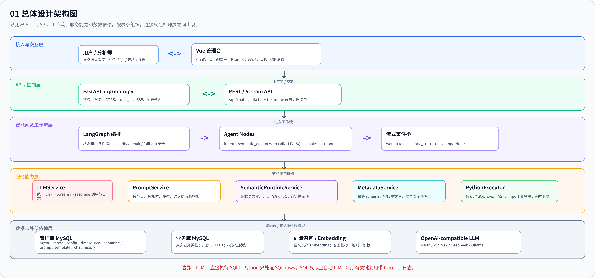
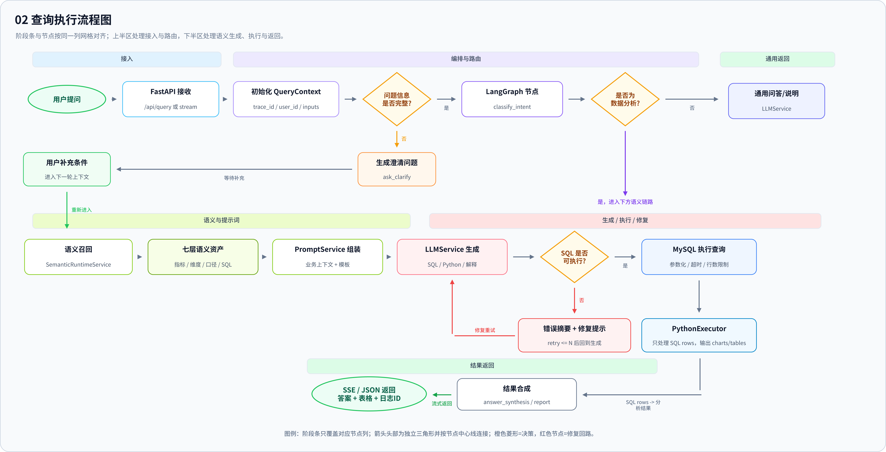
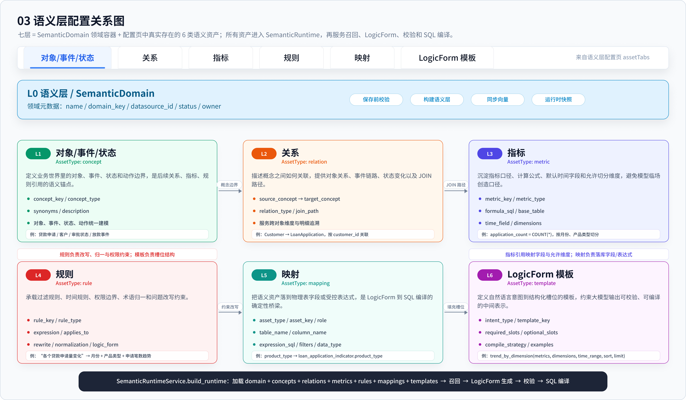
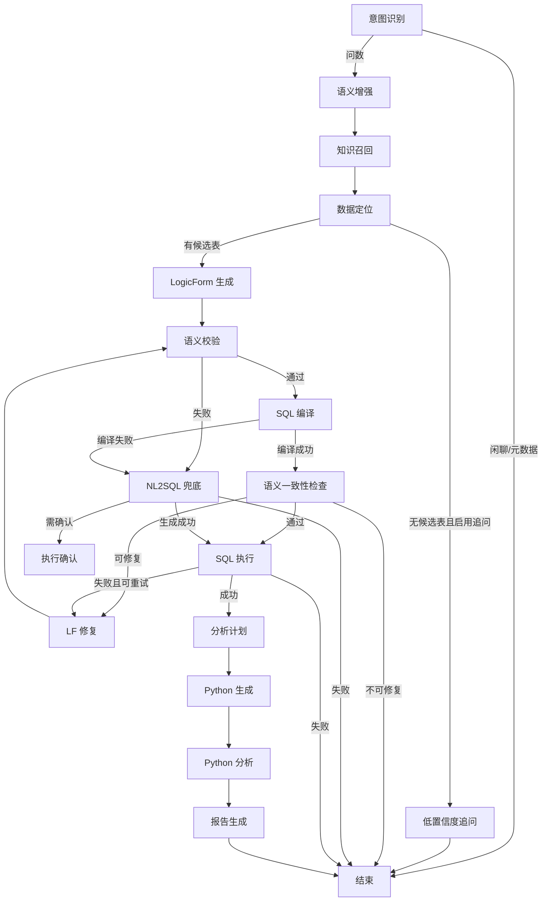
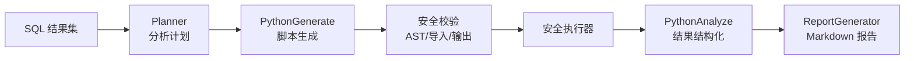
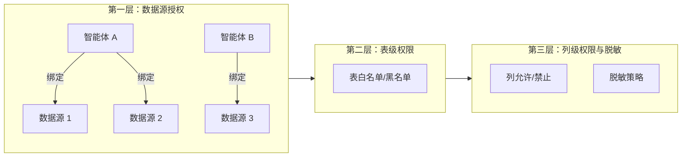
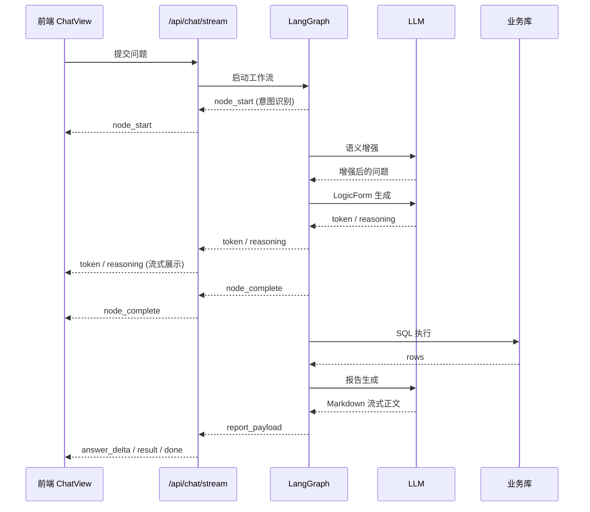

# WenQu 智能问数

[English](./README.md) | 中文

> 基于 LangGraph 的智能问数系统 —— 自然语言提问，自动生成 SQL、执行查询、进行统计分析并生成结构化报告。


---

## 目录

- [核心特性](#核心特性)
- [架构概览](#架构概览)
- [快速开始](#快速开始)
- [详细说明](#详细说明)
  - [核心工作流](#1-核心工作流)
  - [语义层](#2-语义层)
  - [深度分析 (Phase 3)](#3-深度分析-phase-3)
  - [安全体系](#4-安全体系)
  - [流式交互与前端](#5-流式交互与前端)
  - [接口概览](#6-接口概览)
  - [配置参考](#7-配置参考)
  - [数据库设计](#8-数据库设计)
  - [日志与可观测性](#9-日志与可观测性)
  - [开发指南](#10-开发指南)
- [示例](#示例)
- [路线图](#路线图)
- [贡献](#贡献)
- [开源协议](#开源协议)

---

## 核心特性

### 自然语言问数

用户用自然语言提问，系统自动完成意图识别、语义增强、知识召回、数据定位、SQL 生成、执行查询、统计分析和报告生成的全链路闭环。支持多轮对话上下文，追问和纠偏自然衔接。

### 语义层驱动

通过六类语义资产（概念、关系、指标、规则、映射、模板）表达业务口径。命中语义层时，SQL 由 LogicForm 确定性编译生成，指标口径可控、字段映射可追踪、错误可定位。未命中时进入受限 NL2SQL 兜底。

### 深度分析与报告

SQL 查询结果自动进入 Python 安全执行器进行统计分析（分布、趋势、排名、异常检测），最终生成不少于 300 字的中文 Markdown 结构化报告，包含图表和数据解读。

### 多智能体 / 多数据源 / 多模型

支持创建多个智能体，每个智能体可绑定不同数据源、大语言模型和向量模型。智能体间数据隔离，权限独立。

### 安全体系

- JWT 用户认证与角色权限（管理员 / 普通用户）
- SQL 安全校验（单条只读 SELECT、危险关键字拦截、LIMIT 注入）
- 三层权限控制（数据源授权、表级白名单、列级脱敏）
- Python 执行器隔离（AST 校验、导入白名单、资源限制、容器化）
- 数据源密码与模型 API Key 加密落盘

### 流式交互

基于 SSE（Server-Sent Events）的实时流式输出，用户可观察每个处理节点的执行进度、模型思考过程和中间结果。

### 可配置性

Prompt 模板支持按智能体、模型、语义层覆盖；系统参数支持运行时调整召回阈值、执行器配置等。

---

## 架构概览

### 总体设计架构



系统由前端管理台、FastAPI 后端、LangGraph 问数工作流和外部依赖（LLM、MySQL、Milvus）组成。前端通过 REST API 和 SSE 与后端交互，后端通过 LangGraph 编排 16 个处理节点完成问数全链路。

### 查询执行流程



完整流程：用户提问 → 意图识别 → 语义增强 → 知识召回 → 数据定位 → LogicForm 生成 → 语义校验 → SQL 编译 → 语义一致性检查 → SQL 执行 → 分析计划 → Python 生成 → Python 分析 → 报告生成。

### 语义层配置关系



智能体是运行入口，绑定数据源、模型和语义层。语义层下辖概念、关系、指标、规则、映射和模板六类资产。

---

## 快速开始

### 环境要求

| 依赖 | 版本 | 说明 |
|------|------|------|
| Python | >= 3.11 | 后端运行环境 |
| Node.js | >= 18 | 前端构建环境 |
| MySQL | >= 8.0 | 业务库 + 管理库 |
| Milvus | >= 2.5 | 向量数据库（可选，支持本地 Lite 模式） |
| uv | 最新版 | Python 包管理器（推荐） |

### 1. 克隆项目

```bash
git clone https://github.com/<your-org>/wenqu-dataquery-agent.git
cd wenqu-dataquery-agent
```

### 2. 启动依赖服务

使用 Docker Compose 启动 MySQL 和 Milvus：

```bash
docker compose up -d
```

这会启动：
- **MySQL 8.0** — 端口 3306，自动创建管理库 `dataquery_agent` 并导入表结构和示例数据
- **Milvus 2.5** — 端口 19530，本地存储模式

### 3. 后端配置与启动

```bash
# 复制环境配置
cp .env.example .env

# 编辑 .env，至少配置以下项：
# - LLM_BASE_URL / LLM_API_KEY / LLM_MODEL（大语言模型）
# - EMBEDDING_BASE_URL / EMBEDDING_API_KEY / EMBEDDING_MODEL（向量模型）
# - MYSQL_* / MANAGEMENT_MYSQL_*（数据库连接，默认值可直接使用）

# 安装 Python 依赖
uv sync

# 启动后端
uv run uvicorn app.main:app --host 0.0.0.0 --port 4400 --reload
```

后端启动时会自动执行数据库迁移，创建管理库表结构并播种默认配置。

### 4. 前端启动

```bash
cd frontend
npm install
npm run dev
```

前端默认运行在 `http://localhost:5173`，后端 API 运行在 `http://localhost:4400`。

### 5. 导入演示数据（可选）

**信贷风控演示域：**

```bash
# 创建演示表和数据
uv run python examples/loan/seed_loan_indicators.py

# 导入语义层资产
uv run python scripts/import_semantic_bundle.py --path examples/loan/semantic-domain.json
```

**抖音电商演示域：**

```bash
uv run python examples/douyin_ecommerce/seed_douyin_ecommerce.py
```

### 6. 验证

打开 `http://localhost:5173`，注册账号，在智能体管理中授权后，进入对话页面提问：

```
贷款排名前三的申请区域是什么，分别申请了多少笔？
```

观察分析链路中的节点执行过程、SQL 生成结果和最终分析报告。

---

## 详细说明

### 1. 核心工作流

问数链路由 LangGraph StateGraph 编排，共 16 个处理节点：

| 节点 | 文件 | 功能 | 调用 LLM |
|------|------|------|----------|
| `intent_recognition` | `nodes/intent.py` | 意图识别：规则关键词 + LLM 兜底，区分问数/闲聊/元数据查询 | 不一定 |
| `semantic_enhance` | `nodes/semantic_enhance.py` | 语义增强：将原始问题改写为更清晰的业务问法，补全省略的指标、维度和 TopN | 是 |
| `semantic_runtime_recall` | `nodes/semantic_runtime_recall.py` | 知识召回：加载语义资产，向量召回相关指标、维度、规则 | 向量召回 |
| `schema_recall` | `nodes/schema_recall.py` | 数据定位：基于已采集 schema 和语义资产召回候选表、字段和 JOIN 提示 | 否 |
| `clarification` | `nodes/clarification.py` | 低置信度追问：候选表为空时引导用户补充业务对象、时间范围或指标 | 是 |
| `nl2lf_generate` | `nodes/nl2lf_generate.py` | LogicForm 生成：自然语言 → 结构化查询意图（指标/维度/过滤/排序/限制） | 是 |
| `lf_validate` | `nodes/lf_validate.py` | 语义校验：检查 LogicForm 中的指标、维度、过滤和时间口径是否合法 | 否 |
| `lf_repair` | `nodes/lf_repair.py` | LF 修复：移除不支持的维度、未知指标或无法应用的时间范围 | 否 |
| `lf_to_sql_compile` | `nodes/lf_to_sql_compile.py` | SQL 编译：LogicForm 确定性编译为 MySQL SELECT | 否 |
| `nl2sql_fallback` | `nodes/nl2sql_fallback.py` | NL2SQL 兜底：语义层未命中时，基于候选 schema 由 LLM 生成只读 SQL | 是 |
| `semantic_check` | `nodes/analysis_pipeline.py` | 语义一致性检查：验证编译 SQL 是否忠实表达 LogicForm | 否 |
| `sql_confirmation` | `nodes/human_confirm.py` | 执行确认：Human-in-the-loop，等待用户确认 SQL 执行 | 否 |
| `sql_execute` | `nodes/sql_execute.py` | SQL 执行：安全校验 → 权限检查 → 执行 → 脱敏 → 结果格式化 | 否 |
| `planner` | `nodes/analysis_pipeline.py` | 分析计划：分析结果数据特征，推断分析模式，生成分析步骤 | 否 |
| `python_generate` | `nodes/analysis_pipeline.py` | Python 生成：LLM 生成 pandas 分析脚本，AST 安全校验，失败回退安全模板 | 是 |
| `python_analyze` | `nodes/analysis_pipeline.py` | Python 分析：在受限子进程中执行脚本，支持多轮 LLM 修复重试 | 修复时 |
| `report_generator` | `nodes/analysis_pipeline.py` | 报告生成：LLM 流式生成 Markdown 报告，失败回退模板报告 | 是 |

#### 条件路由



### 2. 语义层

语义层是 WenQu 的核心设计，通过结构化的业务资产表达数据口径，避免大模型自由写 SQL。

#### 六类语义资产

| 资产类型 | 说明 | 示例 |
|----------|------|------|
| **概念 (Concept)** | 业务术语定义，含同义词 | `loan_application`（贷款申请），同义词：申请、进件 |
| **关系 (Relation)** | 表间 JOIN 路径和业务关系 | `loan_to_applicant`：loan_application → customer |
| **指标 (Metric)** | 可计算的业务度量，含公式 SQL | `application_count`：COUNT(\*)，按 region 维度分组 |
| **规则 (Rule)** | 业务规则：改写、归一化、逻辑表单 | TopN 追问补全规则、笔数纠偏规则 |
| **映射 (Mapping)** | 语义资产到物理表字段的映射 | `application_count` → `loan_application_indicator.id` (COUNT) |
| **模板 (Template)** | 预定义的查询意图骨架 | 排名查询模板：必填槽位 = [指标, 排名数] |

#### LogicForm 结构

LogicForm 是语义层的核心中间表达，连接自然语言和 SQL：

```json
{
  "metrics": ["application_count"],
  "dimensions": ["application_region"],
  "filters": [
    {"field": "application_date", "operator": ">=", "value": "2024-01-01"}
  ],
  "time_range": {"period": "last_3_months"},
  "sort": [{"field": "application_count", "direction": "desc"}],
  "limit": 3
}
```

#### 编译策略

**同表模式（常规）**：所有指标共享同一个 `base_table`，维度和过滤通过映射解析，关系用于自动推导 JOIN 条件：

```sql
SELECT t0.`region` AS `application_region`, COUNT(*) AS `application_count`
FROM `loan_application_indicator` t0
WHERE t0.`created_at` >= '2024-01-01'
GROUP BY t0.`region`
ORDER BY `application_count` DESC
LIMIT 3
```

**跨表标量模式**：指标分布在不同事实表时，每个指标生成独立标量子查询，CROSS JOIN 合并为单行：

```sql
SELECT
  (SELECT COUNT(*) FROM loan_application_indicator) AS application_count,
  (SELECT SUM(amount) FROM loan_disbursement) AS total_disbursement
```

### 3. 深度分析 (Phase 3)

SQL 执行完成后，结果自动进入深度分析链路：



#### 分析模式

Planner 根据结果数据特征自动推断分析模式：

| 模式 | 触发条件 | 分析内容 |
|------|----------|----------|
| 排名 (Ranking) | 有维度列 + 排序 | TopN 条形图、占比饼图 |
| 趋势 (Trend) | 有时间列 + 数值列 | 折线图、环比变化、趋势判断 |
| 分布 (Distribution) | 有分类列 + 数值列 | 直方图、箱线图、集中度 |
| 异常 (Anomaly) | 数值列偏离均值显著 | 异常点标记、原因分析 |
| 概览 (Profile) | 通用场景 | 基础统计、维度样例、空值分析 |

#### Python 执行器安全机制

| 层级 | 措施 |
|------|------|
| 代码校验 | AST 解析：模块白名单（json/math/pandas 等）、禁用 open/exec/eval/import |
| 进程隔离 | `python -I`（隔离模式）、临时工作目录、禁止访问用户 site-packages |
| 资源限制 | 超时（默认 15s）、内存（默认 512MB）、CPU 限制 |
| 容器化 | Docker/containerd：`--network none`、`--pids-limit 128`、只读挂载 |
| 高安全 | Firecracker 微虚拟机，通过外部 runner 接入 |

#### 报告结构

```json
{
  "markdown": {"body": "流式生成的 Markdown 正文（>= 300 字）"},
  "summary": "从正文提取的摘要",
  "charts": [{"type": "bar", "data": {...}, "echarts_option": {...}}],
  "tables": [{"title": "衍生结果表", "columns": [...], "rows": [...]}],
  "python_result": {"insights": [...], "charts": [...], "tables": [...], "metrics": {...}},
  "generation_source": "llm_report_generator | fallback_template"
}
```

### 4. 安全体系

#### 认证与授权

- **JWT 登录态**：注册/登录获取 access_token，所有 API 请求携带 Bearer Token
- **角色**：管理员（全部权限）、普通用户（按智能体授权）
- **会话隔离**：对话历史按用户隔离，普通用户只能看到自己授权的智能体

#### SQL 安全

执行前通过 `normalize_sql_for_execution` 做保守校验：

| 检查项 | 说明 |
|--------|------|
| 单条 SELECT | 只允许单条只读 SELECT 语句 |
| 危险关键字拦截 | DROP/INSERT/UPDATE/DELETE/UNION/ALTER/CREATE/TRUNCATE |
| 危险函数拦截 | SLEEP/LOAD_FILE/BENCHMARK/INTO OUTFILE/DUMPFILE |
| 系统库拦截 | mysql/information_schema/performance_schema/sys |
| 跨库拦截 | 拒绝引用非当前数据源的表 |
| LIMIT 注入 | 未指定 LIMIT 时自动注入 LIMIT 1000，超过时截断 |
| MySQL 特殊关键字 | PREPARE/EXECUTE/DEALLOCATE/LOAD DATA 等 |

#### 三层权限控制



| 层级 | 控制粒度 | 存储表 |
|------|----------|--------|
| 数据源授权 | 智能体 ↔ 数据源 | `agent_datasource` |
| 表级权限 | 允许/拒绝访问指定表 | `agent_table_permission` |
| 列级权限 | 允许/禁止 + 脱敏策略 | `agent_column_permission` |

**脱敏策略**：

| 策略 | 效果 | 示例 |
|------|------|------|
| `none` | 不脱敏（默认） | `13812345678` → `13812345678` |
| `redact` | 完全遮蔽 | `13812345678` → `***` |
| `partial` | 保留首尾各 2 字符 | `13812345678` → `13****78` |
| `hash` | SHA-256 哈希前 12 位 | `13812345678` → `a1b2c3d4e5f6` |

#### API Key 加密

数据源密码和模型 API Key 使用 `enc:v1:` 前缀密文落盘，旧明文数据兼容读取，重新保存后自动转为密文。

### 5. 流式交互与前端

#### SSE 事件流



#### SSE 事件类型

| 事件 | 说明 | 数据字段 |
|------|------|----------|
| `node_start` | 节点开始执行 | `node`, `label` |
| `node_progress` | 节点执行中进度 | `node`, `label`, `message` |
| `node_complete` | 节点执行完成 | `node`, `label`, `output` |
| `reasoning` | 模型思考过程 | `node`, `label`, `delta` |
| `token` | 流式输出内容 | `node`, `delta` |
| `answer_start` | 最终回答开始 | `session_id` |
| `answer_delta` | 最终回答增量 | `session_id`, `delta` |
| `answer_complete` | 最终回答完成 | `session_id`, `answer` |
| `result` | 完整结果（JSON） | 全部字段 |
| `error` | 异常 | `error_type`, `error_category`, `message` |
| `done` | 结束 | `{}` |

#### 前端页面

| 页面 | 路由 | 功能 |
|------|------|------|
| 对话 | `/` | 问数主界面，含分析链路、SQL、结果表、报告展示 |
| 智能体管理 | `/agent` | 创建/编辑/删除智能体，绑定数据源、模型和语义层 |
| 模型配置 | `/model-config` | 管理大语言模型和向量模型配置，测试连通性 |
| 数据源 | `/datasource` | 数据源连接管理，表清单采集，字段详情查看 |
| 知识库 | `/knowledge` | 语义层配置：概念、关系、指标、规则、映射、模板管理 |
| 系统参数 | `/system-parameter` | 系统参数、Prompt 模板、用户管理 |
| 登录 | `/login` | 用户登录 |
| 注册 | `/register` | 用户注册 |

**技术栈**：Vue 3 + TypeScript + Element Plus + Vite + ECharts

### 6. 接口概览

后端提供以下分类的 REST API：

| 分类 | 前缀 | 说明 |
|------|------|------|
| 健康检查 | `/health` | 服务探活 |
| 对话 | `/api/chat` | 同步/流式问数、SQL 确认、会话管理 |
| 认证 | `/api/auth` | 注册、登录、当前用户 |
| 智能体 | `/api/agent` | 智能体 CRUD、数据源绑定 |
| 数据源 | `/api/datasource` | 数据源 CRUD、连通性测试、Schema 采集 |
| 语义层 | `/api/semantic` | 领域/资产管理、快照版本控制、导入导出、向量同步 |
| 模型配置 | `/api/model-config` | 模型 CRUD、连通性测试 |
| Prompt | `/api/prompt` | Prompt 模板管理、目录查看 |
| 系统参数 | `/api/system` | 运行时参数配置 |
| 用户管理 | `/api/users` | 用户 CRUD、权限管理 |
| 反馈 | `/api/feedback` | 用户反馈回流 |

所有 `/api/*` 端点（除 `/api/auth/login`、`/api/auth/register`）需要 Bearer Token 认证。`/health` 公开访问。

### 7. 配置参考

通过 `.env` 文件或环境变量配置，所有配置都有合理默认值：

#### LLM 大语言模型

| 变量 | 默认值 | 说明 |
|------|--------|------|
| `LLM_PROVIDER` | `ollama` | 提供商：ollama/deepseek/mimo/minimax |
| `LLM_BASE_URL` | `http://127.0.0.1:11434/v1` | OpenAI 兼容 Base URL |
| `LLM_API_KEY` | `ollama` | API Key |
| `LLM_MODEL` | `qwen3:14b` | 模型名 |

#### Embedding 向量模型

| 变量 | 默认值 | 说明 |
|------|--------|------|
| `EMBEDDING_BASE_URL` | `https://api.deepseek.com/v1` | OpenAI 兼容 Base URL |
| `EMBEDDING_API_KEY` | - | API Key |
| `EMBEDDING_MODEL` | `embedding-3` | 模型名 |

#### MySQL 数据库

| 变量 | 默认值 | 说明 |
|------|--------|------|
| `MYSQL_HOST` | `127.0.0.1` | 业务库主机 |
| `MYSQL_PORT` | `3306` | 业务库端口 |
| `MYSQL_USER` | `root` | 业务库用户 |
| `MYSQL_PASSWORD` | `root` | 业务库密码 |
| `MYSQL_DATABASE` | `business_db` | 业务库名 |
| `MANAGEMENT_MYSQL_HOST` | `127.0.0.1` | 管理库主机 |
| `MANAGEMENT_MYSQL_DATABASE` | `dataquery_agent` | 管理库名 |

#### Milvus 向量数据库

| 变量 | 默认值 | 说明 |
|------|--------|------|
| `MILVUS_URI` | `./data/milvus.db` | Milvus 地址或本地文件路径 |
| `MILVUS_COLLECTION` | `dataquery_knowledge` | 集合名 |

#### 应用配置

| 变量 | 默认值 | 说明 |
|------|--------|------|
| `APP_HOST` | `0.0.0.0` | 监听地址 |
| `APP_PORT` | `4400` | 监听端口 |
| `DEBUG` | `true` | 调试模式 |
| `CORS_ALLOWED_ORIGINS` | `http://localhost:4399,...` | CORS 允许源（逗号分隔） |

#### 安全配置

| 变量 | 默认值 | 说明 |
|------|--------|------|
| `ADMIN_API_KEY` | - | API 鉴权 Key（生产必须配置） |
| `JWT_SECRET_KEY` | - | JWT 签名密钥（生产 >= 32 字节） |
| `SECRET_ENCRYPTION_KEY` | - | 密钥加密密钥（生产必须配置） |
| `INITIAL_ADMIN_USERNAME` | - | 初始管理员用户名 |
| `INITIAL_ADMIN_PASSWORD` | - | 初始管理员密码 |
| `API_RATE_LIMIT_PER_MINUTE` | `120` | 每分钟请求限制 |
| `CHAT_STREAM_MAX_CONCURRENT` | `8` | 最大并发流式会话数 |

#### 数据定位召回

| 变量 | 默认值 | 说明 |
|------|--------|------|
| `SCHEMA_RECALL_MAX_TABLES` | `6` | 最多候选表数 |
| `SCHEMA_RECALL_REQUIRED_SCORE_RATIO` | `0.35` | 必须召回相对分阈值 |
| `SCHEMA_RECALL_OPTIONAL_SCORE_RATIO` | `0.15` | 可召回相对分阈值 |

#### Python 执行器

| 变量 | 默认值 | 说明 |
|------|--------|------|
| `PYTHON_EXECUTOR_BACKEND` | `local` | 执行后端：local/worker/docker/containerd/firecracker |
| `PYTHON_EXECUTOR_TIMEOUT_SECONDS` | `15` | 执行超时 |
| `PYTHON_EXECUTOR_MEMORY_MB` | `512` | 内存限制 |

#### 生产模式安全校验

当 `DEBUG=false` 时，以下条件不满足会拒绝启动：
- `JWT_SECRET_KEY` 长度 >= 32 字节
- `SECRET_ENCRYPTION_KEY` 已配置
- MySQL 密码非默认 `root`

### 8. 数据库设计

#### 管理库 (`dataquery_agent`)

管理库存放系统配置、元数据和会话历史：

| 分类 | 表 | 说明 |
|------|-----|------|
| 智能体 | `agent` | 智能体配置，绑定模型和语义层 |
| 模型 | `model_config` | 大语言模型和向量模型配置 |
| 数据源 | `datasource` | 数据库连接信息 |
| 关联 | `agent_datasource` | 智能体 ↔ 数据源多对多 |
| 权限 | `agent_table_permission` | 表级访问控制 |
| 权限 | `agent_column_permission` | 列级访问控制与脱敏 |
| 元数据 | `meta_table` / `meta_column` | 已采集的表结构 |
| 语义层 | `semantic_domain` | 语义领域 |
| 语义层 | `semantic_domain_snapshot` | 语义层版本快照 |
| 语义层 | `semantic_concept` | 概念 |
| 语义层 | `semantic_relation` | 关系 |
| 语义层 | `semantic_metric` | 指标 |
| 语义层 | `semantic_rule` | 规则 |
| 语义层 | `semantic_mapping` | 物理映射 |
| 语义层 | `logic_form_template` | LogicForm 模板 |
| Prompt | `prompt_template` | Prompt 模板 |
| 对话 | `chat_history` | 对话历史（含 reasoning_trace、report_payload） |
| 反馈 | `user_feedback` | 用户反馈 |
| 系统 | `system_parameter` | 运行时参数 |
| 用户 | `app_user` | 系统用户 |
| 用户 | `user_agent_permission` | 用户 ↔ 智能体授权 |

#### 迁移策略

采用**幂等自动迁移**，应用启动时自动执行：

- `CREATE TABLE IF NOT EXISTS` 建表
- 查询 `INFORMATION_SCHEMA` 后按需 `ALTER TABLE ADD COLUMN`
- 查询 `INFORMATION_SCHEMA` 后按需 `CREATE INDEX`
- 默认数据播种（模型配置、系统参数、Prompt 模板、初始管理员）
- 历史数据回填（模型绑定、语义层关联、示例问题）

所有迁移操作幂等可重入，无版本追踪，无回滚机制（仅做前向兼容）。

### 9. 日志与可观测性

#### 日志配置

| 项目 | 配置 |
|------|------|
| 日志文件 | `logs/backend.log` |
| 轮转 | 10MB/文件，保留 5 个备份 |
| 格式 | `%(asctime)s %(levelname)s [%(name)s] %(message)s` |
| 编码 | UTF-8 |

#### 可观测性

| 维度 | 说明 |
|------|------|
| `trace_id` | 贯穿 SSE 事件、执行链路、历史结果和错误响应 |
| 节点耗时 | 每个节点记录开始/结束时间 |
| SQL 执行记录 | 耗时、慢查询标识（>2s）、行数 |
| LLM 调用日志 | 模型名、消息数、字符数、缓存命中 |
| 错误分级 | permission/sql/timeout/llm/runtime 分类 |
| 流式事件日志 | SSE 事件压缩后写入日志 |

### 10. 开发指南

#### 项目结构

```
wenqu-dataquery-agent/
├── app/                          # 后端应用
│   ├── main.py                   # FastAPI 入口、SSE 流式接口
│   ├── config.py                 # Pydantic Settings 配置
│   ├── security.py               # 鉴权中间件与限流
│   ├── logging_config.py         # 日志配置
│   ├── agent/                    # LangGraph 问数链路
│   │   ├── graph.py              # 工作流定义与条件路由
│   │   ├── nodes/                # 16 个处理节点
│   │   ├── prompts/              # 默认 Prompt 模板
│   │   ├── python_templates/     # Python 兜底分析脚本
│   │   └── domain_rules.py       # 领域改写规则
│   ├── api/                      # REST API 路由
│   ├── services/                 # 业务逻辑服务
│   ├── models/                   # Pydantic 数据模型
│   ├── db/                       # 数据库 schema、迁移、SQL
│   └── utils/                    # 工具函数
├── frontend/                     # 前端应用
│   ├── src/
│   │   ├── views/                # 页面组件
│   │   ├── components/           # 通用组件
│   │   ├── stores/               # Pinia 状态管理
│   │   ├── api/                  # API 客户端
│   │   └── router/               # 路由配置
│   └── package.json
├── docs/                         # 文档
│   ├── project-design.md         # 项目总体设计
│   ├── TODO.md                   # 开发进度
│   ├── design-qa.md              # 设计 QA 记录
│   └── images/                   # 架构图
├── examples/                     # 演示数据
│   ├── loan/                     # 信贷风控域
│   └── douyin_ecommerce/         # 抖音电商域
├── scripts/                      # 工具脚本
├── tests/                        # 测试用例
├── docker-compose.yml            # 依赖服务编排
├── pyproject.toml                # Python 项目配置
├── .env.example                  # 环境变量示例
└── uv.lock                       # Python 依赖锁文件
```

#### 测试

```bash
# 后端测试
uv run pytest -q

# 前端测试
npm --prefix frontend test

# 前端构建
npm --prefix frontend run build
```

#### 代码质量

```bash
# Python Lint
uv run ruff check .

# Python Format
uv run ruff format .
```

#### 添加新节点

1. 在 `app/agent/nodes/` 创建节点文件
2. 实现 `async def xxx_node(state: AgentState) -> dict`
3. 在 `app/agent/graph.py` 注册节点和边
4. 在 `app/main.py` 的 `NODE_LABELS` 添加中文标签
5. 在 `app/agent/prompts/` 添加 Prompt 模板（如需调用 LLM）
6. 在 `app/agent/prompts/__init__.py` 的 `PROMPT_CATALOG` 登记

---

## 示例

### 信贷风控

```bash
uv run python examples/loan/seed_loan_indicators.py
uv run python scripts/import_semantic_bundle.py --path examples/loan/semantic-domain.json
```

可问示例：
- 贷款排名前三的申请区域是什么，分别申请了多少笔？
- 最近三个月各月的申请笔数趋势
- 各贷款产品的平均放款金额
- 高 PD 客户的催收回收率

### 抖音电商

```bash
uv run python examples/douyin_ecommerce/seed_douyin_ecommerce.py
```

可问示例：
- 最近三个月各个类目的 GMV 变化趋势是什么？
- GMV 排名前 10 的达人是谁，分别成交了多少？
- 不同成交渠道的订单量和 GMV 分别是多少？
- 各投放类型的消耗、归因 GMV 和 ROI 表现如何？

---

## 路线图

- [ ] SQL AST 安全校验增强（接入专用解析库）
- [ ] Prompt 模板版本管理与命中统计
- [ ] 多数据源类型支持（PostgreSQL、ClickHouse）
- [ ] 细粒度权限审计日志
- [ ] Docker 一键部署方案
- [ ] CI/CD 流水线（GitHub Actions）

---

## 贡献

欢迎贡献！请遵循以下步骤：

1. Fork 本仓库
2. 创建特性分支 (`git checkout -b feature/your-feature`)
3. 提交变更 (`git commit -m 'Add your feature'`)
4. 推送到分支 (`git push origin feature/your-feature`)
5. 创建 Pull Request

请确保：
- 后端测试通过：`uv run pytest -q`
- 前端测试通过：`npm --prefix frontend test`
- 代码通过 Lint：`uv run ruff check .`

---

## 开源协议

本项目基于 [Apache License 2.0](./LICENSE) 开源。

Copyright 2026 WenQu DataQuery Agent Contributors
