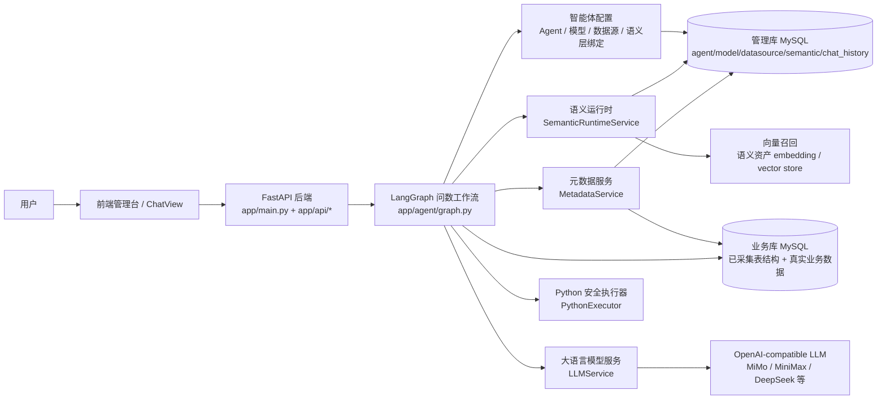
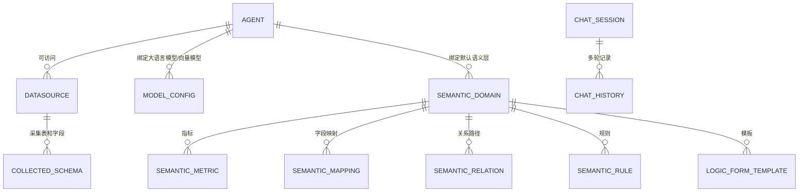
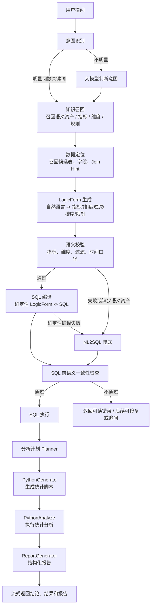
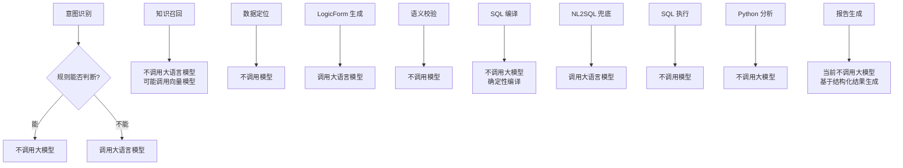
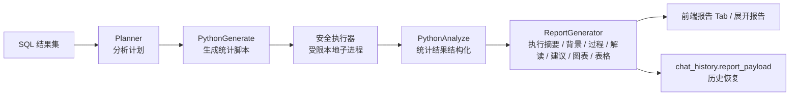
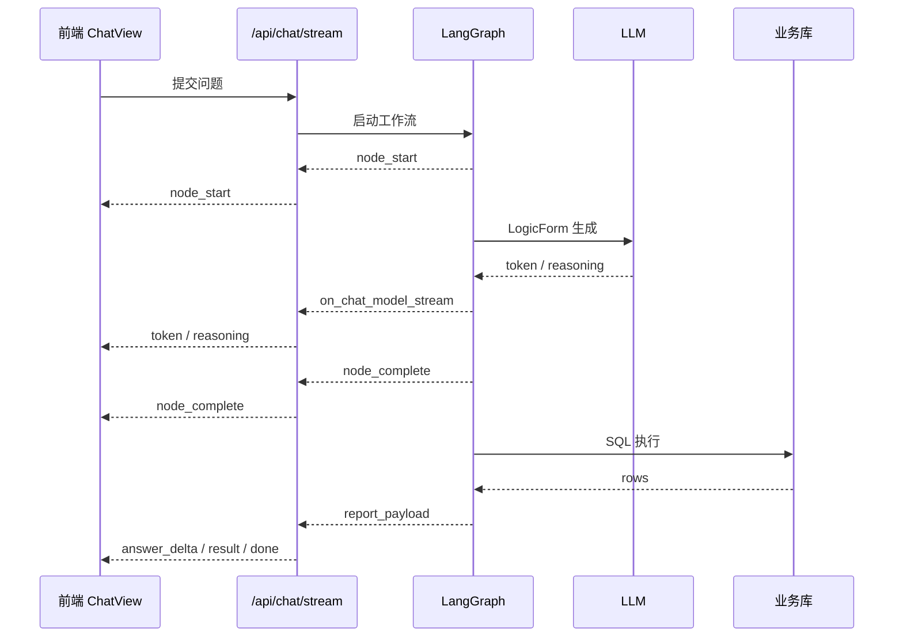

# WenQu 智能问数项目总体设计

## 1. 项目定位

WenQu 是一个面向业务人员和数据分析人员的智能问数系统。用户用自然语言提问，系统结合智能体配置、数据源元数据、语义层资产和大模型能力，生成可执行 SQL，查询业务库，并在 Phase 3 中进一步生成统计分析和结构化报告。

当前系统的核心目标不是让大模型直接自由写 SQL，而是尽量把问数过程拆成可控链路：

- 用语义层表达业务口径。
- 用 LogicForm 表达结构化查询意图。
- 用确定性编译生成 SQL。
- 在语义层未命中时才进入受限 NL2SQL 兜底。
- 查询结果进入 Python 安全执行器做统计分析。
- 最终生成可展示、可落地、可恢复的分析报告。

## 2. 总体架构



### 前端

- `ChatView`：问数主界面，负责会话、流式过程、SQL、结果表、报告展示。
- `AgentList`：智能体管理，绑定数据源、模型和语义层。
- `ModelConfig`：模型配置，区分大语言模型和向量模型。
- `DatasourceConfig`：数据源管理，读取表清单、选择采集表、查看字段详情。
- `KnowledgeConfig`：语义层配置，维护领域、指标、映射、规则、关系和模板。

### 后端

- `app/main.py`：FastAPI 入口、SSE 流式问数接口、日志和历史落盘。
- `app/agent/graph.py`：LangGraph 查询工作流。
- `app/agent/nodes/*`：意图识别、知识召回、数据定位、LogicForm、SQL、Python 分析、报告生成等节点。
- `app/services/*`：LLM、模型配置、语义运行时、元数据、Python 执行器等服务层。

## 3. 配置关系模型



### 设计原则

- 智能体是运行入口，决定可用数据源、模型和默认语义层。
- 数据源只负责连接和物理 schema，采集哪些表由用户选择，避免全库噪音。
- 语义层表达业务口径，例如指标、维度、映射、规则、关系。
- 模型配置分为大语言模型和向量模型。大语言模型用于理解、生成 LogicForm 或兜底 SQL；向量模型用于知识召回。
- 会话历史保存用户问题、最终回答、SQL、结果、思考过程、分析报告，保证历史恢复。

## 4. 问数主流程



## 5. 哪些节点调用模型



| 节点 | 是否调用大语言模型 | 说明 |
| --- | --- | --- |
| 意图识别 | 不一定 | 明显问数走规则，不明显才调用模型 |
| 知识召回 | 否 | 主要依赖语义资产和向量召回；向量召回可能调用向量模型 |
| 数据定位 | 否 | 基于已采集 schema、注释、语义资产和外键关系排序 |
| LogicForm 生成 | 是 | 将自然语言转换成结构化查询意图 |
| 语义校验 | 否 | 检查指标、维度、过滤、时间口径是否合法 |
| SQL 编译 | 否 | 命中语义层后，SQL 由 LogicForm 确定性编译生成 |
| NL2SQL 兜底 | 是 | 语义层未命中或编译失败时，基于候选 schema 生成只读 SQL |
| SQL 执行 | 否 | 访问业务库 |
| Python 分析 | 否 | 只处理 SQL 结果集，不直接访问业务库 |
| 报告生成 | 当前否 | 当前基于统计结果拼装结构化报告 |

## 6. 语义层与 SQL 生成策略

### 命中语义层

命中语义层时，系统先生成 LogicForm，再通过语义运行时确定性编译 SQL。

示例：

```json
{
  "metrics": ["application_count"],
  "dimensions": ["application_region"],
  "sort": [{"field": "application_count", "direction": "desc"}],
  "limit": 3
}
```

编译结果类似：

```sql
SELECT t0.`region` AS `application_region`, COUNT(*) AS `application_count`
FROM `loan_application_indicator` t0
GROUP BY t0.`region`
ORDER BY `application_count` DESC
LIMIT 3
```

这一步不让大模型自由写 SQL，原因是：

- 指标口径可控。
- 字段映射可追踪。
- 错误更容易定位。
- 后续权限、安全和审计更容易接入。

### 未命中语义层

未命中语义层、LogicForm 校验失败或确定性编译失败时，进入 NL2SQL 兜底。

兜底不是全库裸生成 SQL，而是：

- 只使用已采集 schema。
- 优先使用“数据定位”召回的候选表和字段。
- 生成单条只读 SELECT。
- 后续需要继续接入更严格的 SQL AST 安全校验。

## 7. Phase 3 深度分析与报告

Phase 3 的目标是把“查出结果”推进到“解释结果并形成报告”。



### Python 执行边界

Python 阶段只处理 SQL 返回的结果集，不直接访问业务库。当前开发模式使用受限本地子进程，后续生产模式应替换为轻量隔离进程池或独立 worker 服务，高安全场景再考虑 Docker、containerd 或 Firecracker。

### 报告结构

当前报告 payload 的目标结构：

- 执行摘要：行数、核心指标、核心维度、Top 结论。
- 分析背景与用户诉求：原始问题、指标和维度背景。
- 数据分析过程：SQL 查询、统计画像、结果整理。
- 结果解读：极值、均值、Top 差值、空值情况。
- 建议与后续行动：下钻方向、口径复核、后续分析建议。
- 图表数据：当前前端可轻量渲染，后续可升级为 ECharts。
- 结果明细：展示前若干行，完整结果仍在结果表里。

## 8. 流式交互设计

问数接口使用 SSE 返回事件。前端按事件更新同一个 assistant message。



### 前端滚动策略

- 用户接近底部时，新流式事件自动跟随到底部。
- 用户手动上滑阅读历史时，暂停自动滚动。
- 有新内容但未跟随时，显示“回到底部”入口。
- 用户回到底部后恢复自动跟随。

## 9. 日志与持久化

- 后端日志写入 `logs/`。
- LLM prompt 和流式事件会写入后端日志，便于排查模型输入输出。
- `chat_history` 保存：
  - 用户问题和最终回答。
  - SQL、LogicForm、SQL 结果。
  - reasoning trace。
  - plan、semantic_check、python_result、report_payload。

## 10. 后续演进方向

- SemanticCheck 自动修复增强：不一致时进入可解释修复或追问。
- 报告图表增强：接入 ECharts 图表建议和可视化片段。
- SQL 安全加固：AST 解析、只读查询、limit 注入、危险函数和跨库访问拦截。
- 权限控制：智能体级数据源授权、表级/列级权限、脱敏策略。
- 生产 Python 执行器：独立 worker、资源限制、任务级临时目录和更强隔离。
- Prompt 管理：按智能体、模型和语义层配置 prompt 模板。
