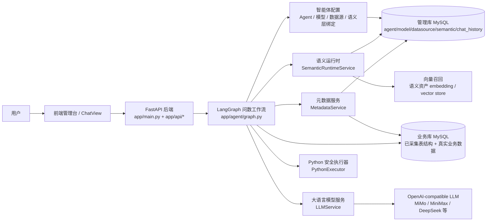
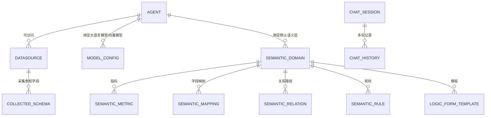
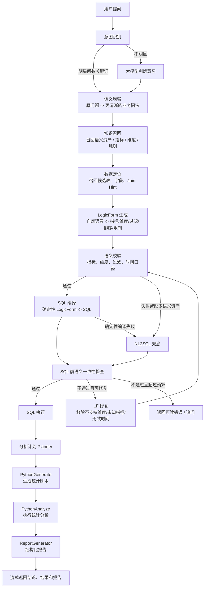
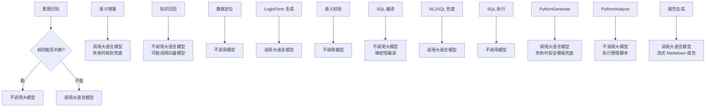
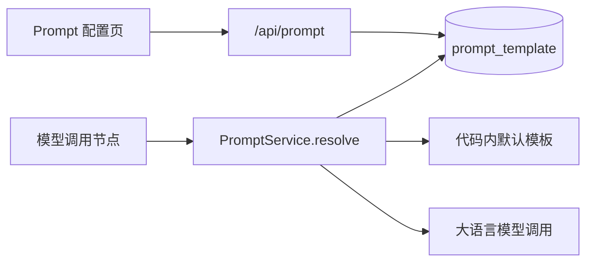
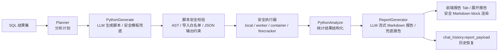
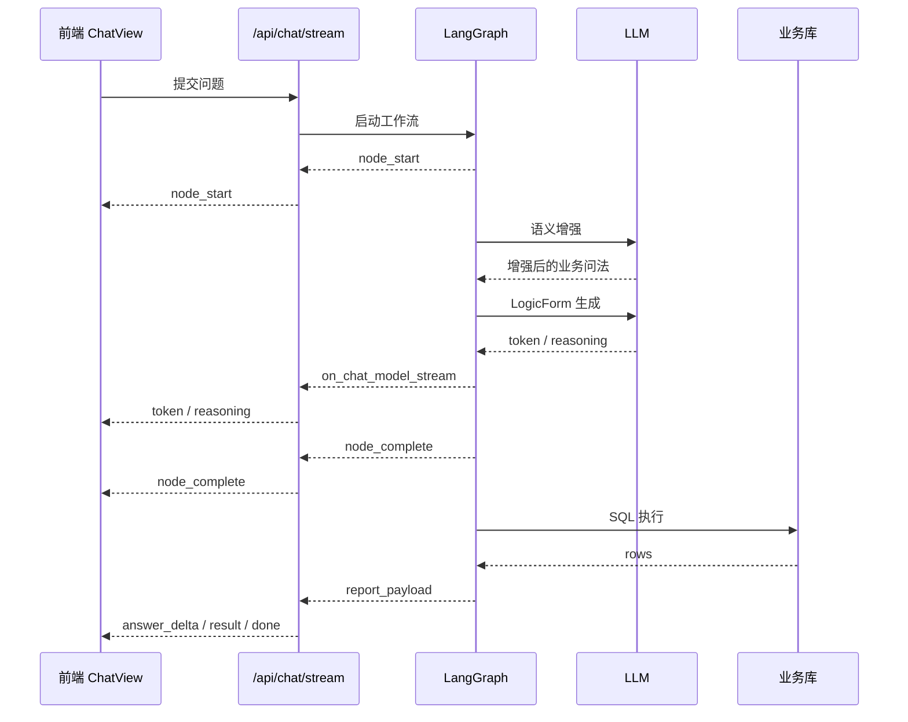

# WenQu 智能问数项目总体设计

## 1. 项目定位

WenQu 是一个面向业务人员和数据分析人员的智能问数系统。用户用自然语言提问，系统结合智能体配置、数据源元数据、语义层资产和大模型能力，生成可执行 SQL，查询业务库，并在 Phase 3 中进一步生成统计分析和结构化报告。

当前系统的核心目标不是让大模型直接自由写 SQL，而是尽量把问数过程拆成可控链路：

- 用语义层表达业务口径。
- 用语义增强把用户原始问题改写成更清晰的业务问法。
- 用 LogicForm 表达结构化查询意图。
- 用确定性编译生成 SQL。
- 在语义层未命中时才进入受限 NL2SQL 兜底。
- 查询结果进入 Python 安全执行器做统计分析。
- 最终生成可展示、可落地、可恢复的分析报告。

## 2. 总体架构



### 前端

- `ChatView`：问数主界面，负责会话、流式过程、SQL、结果表、报告展示。
- `AgentList`：智能体管理，绑定数据源、模型和语义层。
- `ModelConfig`：模型配置，区分大语言模型和向量模型。
- `PromptConfig`：Prompt 模板配置，按节点、智能体、模型和语义层覆盖系统提示词。
- `DatasourceConfig`：数据源管理，读取表清单、选择采集表、查看字段详情。
- `KnowledgeConfig`：语义层配置，维护领域、指标、映射、规则、关系和模板。

### 后端

- `app/main.py`：FastAPI 入口、SSE 流式问数接口、日志和历史落盘。
- `app/agent/graph.py`：LangGraph 查询工作流。
- `app/agent/nodes/*`：意图识别、语义增强、知识召回、数据定位、LogicForm、SQL、Python 分析、报告生成等节点。
- `app/services/*`：LLM、模型配置、语义运行时、元数据、Python 执行器等服务层。

## 3. 配置关系模型



### 设计原则

- 智能体是运行入口，决定可用数据源、模型和默认语义层。
- 数据源只负责连接和物理 schema，采集哪些表由用户选择，避免全库噪音。
- 语义层表达业务口径，例如指标、维度、映射、规则、关系。
- 模型配置分为大语言模型和向量模型。大语言模型用于理解、生成 LogicForm 或兜底 SQL；向量模型用于知识召回。
- 会话历史保存用户问题、最终回答、SQL、结果、思考过程、分析报告，保证历史恢复。

## 4. 问数主流程



## 5. 哪些节点调用模型



| 节点 | 是否调用大语言模型 | 说明 |
| --- | --- | --- |
| 意图识别 | 不一定 | 明显问数走规则，不明显才调用模型 |
| 语义增强 | 是 | 把原始问题改写成更完整的业务自然语言；失败时规则兜底 |
| 知识召回 | 否 | 主要依赖语义资产和向量召回；向量召回可能调用向量模型 |
| 数据定位 | 否 | 基于已采集 schema、注释、语义资产和外键关系排序 |
| LogicForm 生成 | 是 | 将自然语言转换成结构化查询意图 |
| 语义校验 | 否 | 检查指标、维度、过滤、时间口径是否合法 |
| SQL 编译 | 否 | 命中语义层后，SQL 由 LogicForm 确定性编译生成 |
| NL2SQL 兜底 | 是 | 语义层未命中或编译失败时，基于候选 schema 生成只读 SQL |
| SQL 执行 | 否 | 访问业务库 |
| PythonGenerate | 是 | 根据用户语义、SQL 结果样例和分析计划生成 Python 分析脚本；脚本需通过安全校验，失败回退默认安全模板 |
| PythonAnalyze | 否 | 在可插拔安全执行器里执行脚本，只处理 SQL 结果集，不直接访问业务库 |
| 报告生成 | 是 | 基于 SQL、Python 分析结果和样例数据流式生成 Markdown 报告；失败时回退增强版结构化报告 |

## 6.5 Prompt 管理

Prompt 模板是 Phase 4 的生产化配置能力，用于把节点提示词从代码常量中抽出来，允许针对不同业务场景覆盖。



当前支持的模板 key：

- `semantic_enhance.system`：语义增强系统提示词。
- `nl2lf_generate.system`：LogicForm 生成系统提示词。
- `nl2sql_fallback.system`：NL2SQL 兜底系统提示词。
- `phase3_python_generate.system`：深度分析 Python 脚本生成提示词。
- `phase3_report_generator.system`：深度分析 Markdown 报告生成提示词。

匹配优先级按具体程度选择：同时命中智能体、模型和语义层的模板优先于全局模板；模板变量渲染失败时自动回退到代码内默认模板，避免配置错误直接打断问数链路。

## 6.6 深度分析节点与 Python 模板

深度分析实现位于 `app/agent/nodes/analysis_pipeline.py`，不再使用开发阶段的 `phase3.py` 作为主实现命名；`phase3.py` 仅作为临时兼容导出层。兜底 Python 分析脚本统一放在 `app/agent/python_templates/`，当前包括通用分析模板和多序列趋势模板。节点只负责选择“大模型生成脚本”或“安全模板兜底”，模板本体不再写在节点代码中。

Python 分析执行采用轻量 ReAct 修复闭环：脚本执行失败时，节点先记录错误观察，再携带失败脚本、stderr 和样例数据调用大模型重写脚本；重写脚本通过安全校验后再次执行。若修复仍失败，则切换安全模板兜底；全部失败时才进入报告生成，并将报告状态标记为 `analysis_failed`，报告正文显示“分析执行提示”而不是假装深度分析成功。

## 6. 语义层与 SQL 生成策略

### 命中语义层

命中语义层时，系统先保留原始问题，再生成增强问题，后续知识召回和 LogicForm 生成优先使用增强问题，最后通过语义运行时确定性编译 SQL。

示例：

```json
{
  "metrics": ["application_count"],
  "dimensions": ["application_region"],
  "sort": [{"field": "application_count", "direction": "desc"}],
  "limit": 3
}
```

编译结果类似：

```sql
SELECT t0.`region` AS `application_region`, COUNT(*) AS `application_count`
FROM `loan_application_indicator` t0
GROUP BY t0.`region`
ORDER BY `application_count` DESC
LIMIT 3
```

这一步不让大模型自由写 SQL，原因是：

- 指标口径可控。
- 字段映射可追踪。
- 错误更容易定位。
- 后续权限、安全和审计更容易接入。

### 未命中语义层

未命中语义层、LogicForm 校验失败或确定性编译失败时，进入 NL2SQL 兜底。

兜底不是全库裸生成 SQL，而是：

- 只使用已采集 schema。
- 优先使用“数据定位”召回的候选表和字段。
- 生成单条只读 SELECT。
- 后续需要继续接入更严格的 SQL AST 安全校验。

## 7. Phase 3 深度分析与报告

Phase 3 的目标是把“查出结果”推进到“解释结果并形成报告”。



### Python 执行边界

Python 阶段只处理 SQL 返回的结果集，不直接访问业务库。`PythonGenerate` 优先使用大模型根据用户语义生成脚本，但脚本必须使用执行器注入的 `rows` 变量，并通过 AST、安全调用、导入白名单和 JSON 输出约束；不安全、过短或生成失败时回退默认安全模板。当前开发模式使用受限本地子进程，生产默认推荐独立 worker 或轻量隔离进程池，高安全场景再考虑 Docker、containerd 或 Firecracker。

### 报告结构

当前报告 payload 的目标结构：

- `markdown/body`：后端大模型流式生成的 Markdown 正文，正常结果要求不少于 300 个中文字符。
- `summary`：从 Markdown 正文提取的摘要，用于报告预览和最终回答。
- `charts`：Python 分析或报告生成得到的 chart data 与 `echarts_option`，支持排名、趋势、结构分布等模式。
- `tables`：Python 分析输出的衍生结果表或 SQL 结果样例表。
- `python_result`：脚本执行输出，包含 `insights/charts/tables/metrics/null_counts/analysis_mode`。
- `generation_source`：标记 `llm_report_generator` 或 `fallback_template`，便于排查报告是否来自模型。

前端不使用 `v-html` 渲染报告正文，而是把 Markdown 拆成标题、段落、列表、代码块和表格等安全 block。固定的 KPI/图表/表格只作为报告附件展示，报告主体以后端流式正文为准。

## 8. 流式交互设计

问数接口使用 SSE 返回事件。前端按事件更新同一个 assistant message。



### 当前真流式实现约定

- `nl2lf_generate`、`nl2sql_fallback` 这类强依赖模型输出的节点，优先通过 LangChain custom event `wenqu_token` 向 SSE 转发真正的流式 token。
- `on_chat_model_stream` 仍然保留，但在上述节点里只作为兜底，不再和 custom token 同时对前端双重透出，避免首段内容重复。
- 前端主视图优先消费：
  - `node_start / node_progress / node_complete`
  - `reasoning`
  - `token`
- 历史记录会把 `reasoning_trace.events / reasoning / streamText / output` 一并落盘，保证切换会话后还能恢复当时的过程内容，而不只是最终回答。
- Phase 3 的 `python_generate / python_analyze / report_generator` 会把真实脚本、分析 JSON 和报告正文通过 `wenqu_token` 逐段透出；节点完成时再写入结构化 `python_result / report_payload`，用于历史恢复和报告展开页。

### 前端滚动策略

- 用户接近底部时，新流式事件自动跟随到底部。
- 用户手动上滑阅读历史时，暂停自动滚动。
- 有新内容但未跟随时，显示“回到底部”入口。
- 用户回到底部后恢复自动跟随。

### 对话主视图的展示原则

当前 `ChatView` 不再把“简单实时输出”和“展开技术细节”拆成两套内容，而是把每次问数渲染为一段持续增长的实时分析流：

- 主聊天区按固定业务链路顺序输出：意图识别、语义增强、知识召回、数据定位、LogicForm 生成、语义校验、SQL 编译或 NL2SQL 兜底、语义一致性检查、SQL 执行、分析计划、Python 生成、Python 分析、报告生成。
- LLM 的 token、Python 脚本、Python 分析 JSON、报告正文按到达顺序即时追加到对应章节。
- 知识召回、数据定位、SQL 执行等代码节点在完成时把结构化结果渲染成候选资产、候选表字段、关联提示和结果样例。
- 流程完成后自动收起过程，只保留“展开分析过程”入口；最终结论只在流程完成后展示，避免过程中提前出现结论占位。

## 9. 日志与持久化

- 后端日志写入 `logs/`。
- LLM prompt 和流式事件会写入后端日志，便于排查模型输入输出。
- 同步和流式问数都会生成 `trace_id`，贯穿 SSE 事件、执行链路、历史结果和错误响应。
- SQL 执行会记录耗时、慢查询标识和行数，便于排查数据库侧问题。
- `chat_history` 保存：
  - 用户问题和最终回答。
  - SQL、LogicForm、SQL 结果。
  - reasoning trace。
  - plan、semantic_check、python_result、report_payload。

## 10. 生产化控制面

### SQL 安全

执行前通过 `normalize_sql_for_execution` 做保守校验：

- 只允许单条 `SELECT`。
- 拦截 `DROP`、`INSERT`、`UPDATE`、`DELETE`、`UNION` 等危险关键字。
- 拦截 `SLEEP`、`LOAD_FILE`、`BENCHMARK` 等危险函数。
- 拦截系统库和跨库表引用。
- 对顶层查询注入或截断 `LIMIT`，默认上限 1000。

### 权限与脱敏

权限分三层：

- 数据源授权：智能体只能访问绑定的数据源。
- 表级权限：`agent_table_permission` 支持表级允许/拒绝。
- 列级权限：`agent_column_permission` 支持列级允许/拒绝，以及 `redact`、`partial`、`hash` 脱敏策略。

权限同时作用于数据定位、NL2SQL 兜底上下文和 SQL 执行结果，避免模型看到或返回不该暴露的表字段。

### API Key 与模型连通性

模型配置支持：

- API Key 脱敏显示，保存时不回显明文。
- 编辑时不修改 Key 会保留原密钥，输入新 Key 才覆盖。
- `api_key_expires_at`、过期和即将过期提醒。
- 模型连通性测试：大语言模型走 `/chat/completions`，向量模型走 `/embeddings`。

### Human-in-the-loop

当前 HITL 基础闭环包括：

- SQL 执行前确认：请求携带 `require_sql_confirmation` 时，工作流停在 `sql_confirmation` 节点并返回待确认 SQL。
- 确认后继续执行：`/api/chat/confirm-sql` 接收已确认 SQL，复用 SQL 安全、权限、脱敏和 Phase 3 报告链路继续执行。
- 低置信度追问：请求启用 `enable_low_confidence_clarification` 且数据定位没有候选表/字段时，进入追问节点。
- 用户反馈回流：`/api/feedback` 记录 `agent_id`、`session_id`、`trace_id`、评分、备注和上下文 payload，供后续评估和 Prompt/语义层迭代。

## 11. 后续演进方向

- 语义层快照已支持保存、查看、差异对比与一键回滚，仍建议在生产库上保留操作确认和审计。
- 高安全 Python 执行器已完成接口和配置选择，Docker/containerd/Firecracker 运行时由部署环境接入，当前代码侧只负责命令封装与隔离参数。
- Prompt 模板已支持管理和覆盖，后续可增加版本、灰度和命中统计。
- SQL 安全当前采用保守词法/结构化校验，后续可接入专用 SQL AST 解析库进一步提高复杂 SQL 识别能力。
- LLM 调用耗时已通过规则短路、Prompt 缓存和长度截断做了一轮收敛，后续主要关注模型服务本身的延迟和命中率。
