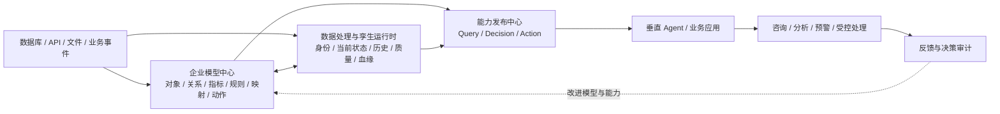
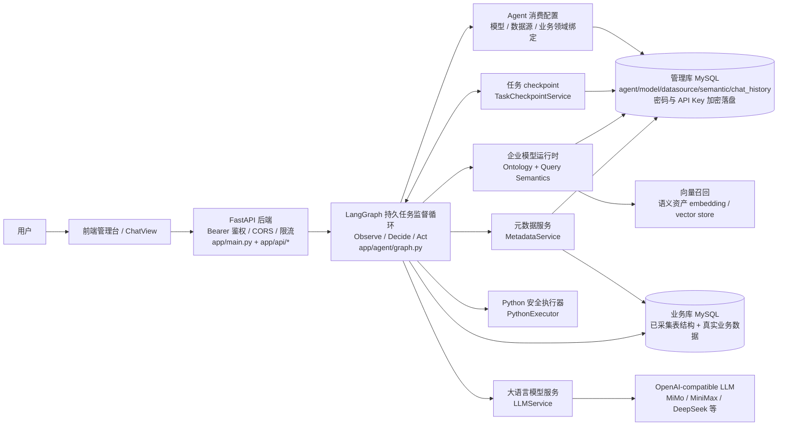
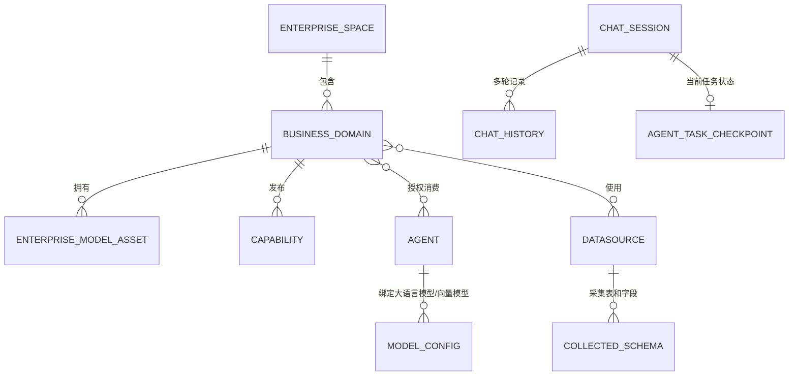
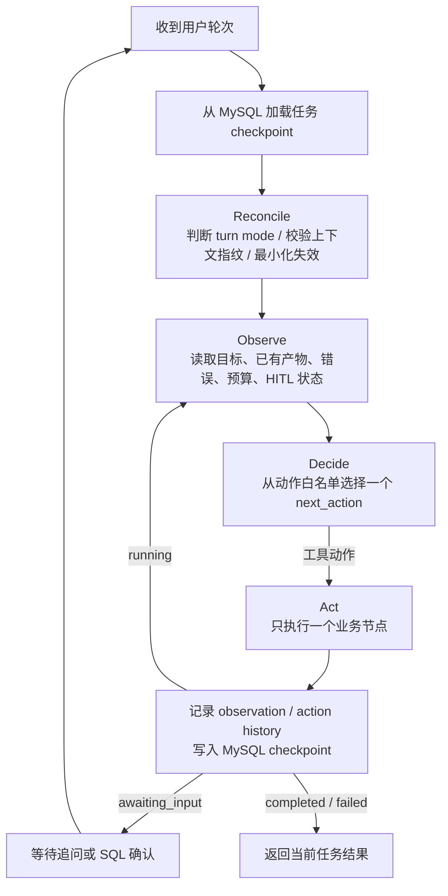
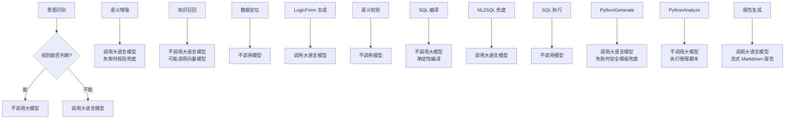
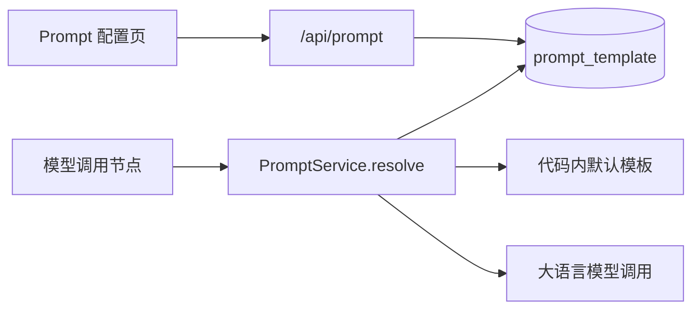
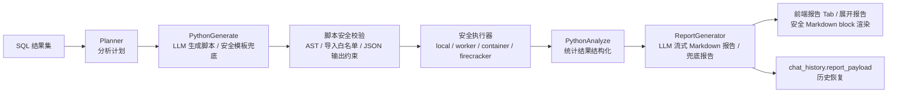
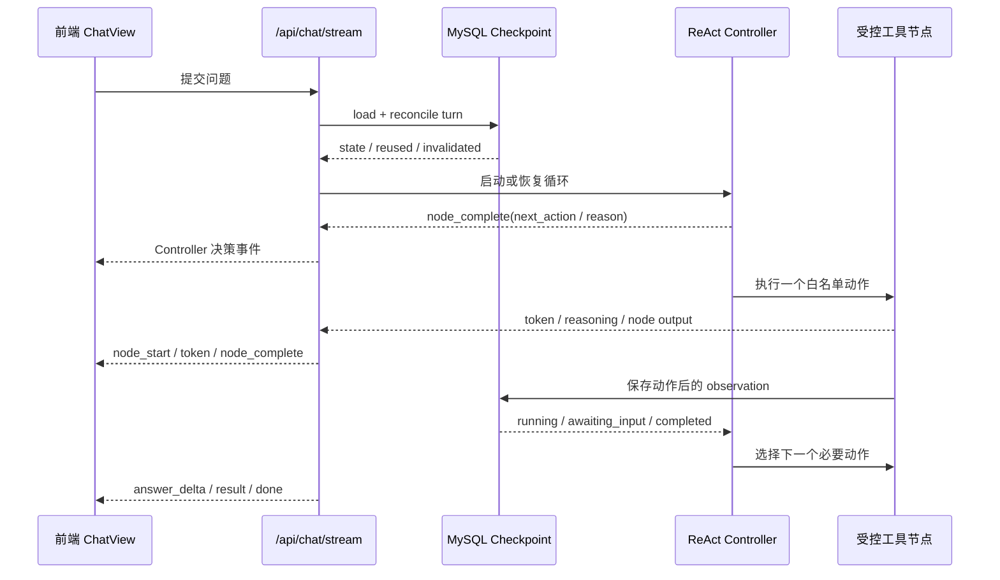

# 问渠 WenQu 企业运营数字孪生与智能决策平台总体设计

> 文档基准日期：2026-09-03

## 1. 项目定位

问渠 WenQu 定位为 **Ontology 驱动的企业运营数字孪生与智能决策平台**。平台把业务人员对企业的理解，与数据库、API、文件和业务事件中的数据连接起来，形成 AI 可理解、可查询、可判断、可执行、可追溯的统一业务模型。

平台是企业智能中枢和决策引擎。财税报告交付、贷款风控和智能问数是其上的垂直应用与验证场景；Agent 负责在具体场景中与用户交互和调用能力，不拥有企业本体本身。

平台主链为：

```text
企业业务理解 + 真实业务数据
-> 企业模型中心
-> 数据处理与孪生运行时
-> Query / Decision / Action Capability
-> 垂直 Agent / 业务应用
-> 结果反馈与决策审计
```

当前系统的技术原则保持不变：

- 用企业空间和业务领域明确模型、数据、能力的资产归属和治理边界。
- 用统一企业模型表达业务对象、属性、关系、事件、状态、指标、规则、映射和可执行动作。
- 现有 Ontology 与查询语义服务分阶段兼容，产品入口、稳定对象标识和发布边界先统一。
- 用语义增强把用户原始问题改写成更清晰的业务问法。
- 用 LogicForm 表达结构化查询意图。
- 用确定性编译生成 SQL。
- 在语义层未命中时才进入受限 NL2SQL 兜底。
- 查询结果进入 Python 安全执行器做统计分析。
- 当前可生成可展示、可恢复的分析报告；风险事项、证据、人工复核和不可变报告版本作为垂直技术切片保留。
- 正式决策动作必须经过权限与人工边界控制，并保留贯穿查询、报告和动作的审计记录。

### 1.1 能力边界

| 状态 | 能力范围 |
|---|---|
| 已实现基础 | 查询语义资产、LogicForm 与确定性 SQL、Ontology 对象/关系/动作 CRUD、实例、校验发布和审计原型，以及可演示的智能问数、Python 分析和报告 |
| 已实现技术切片 | 对象查询、第一版 Query Capability、Action 工具；贷款域风险事项、证据、指派复核、报告版本和决策审计闭环 |
| P0 兼容骨架 | 默认企业空间与领域归属、Agent-领域多对多、统一企业模型入口，以及复用现有 API 的孪生运行页和能力发布中心页 |
| 后续平台建设 | 生产级增量同步/CDC、身份解析、状态历史、数据质量/血缘、正式能力发布治理、通用 Decision Capability 和可靠外部写回 |

当前新增能力先使用贷款风控域做回归和技术验证。贷款数据、阈值、规则和结论均为合成演示，不构成真实授信、财务、税务、会计、审计或其他合规意见。

## 2. 总体架构

### 2.1 平台主架构（目标）



三块核心能力的职责边界：

- **企业模型中心**负责业务含义和逻辑，是原“查询语义”与“本体建模”的统一产品入口。
- **孪生运行时**负责把物理数据持续转换为有身份、有状态、有来源的业务对象。
- **能力发布中心**负责把内部对象、查询、判断和动作发布为 Agent/应用可依赖的类型化契约。

P0 只建立兼容骨架和统一可见入口：默认企业空间/领域归属、Agent 多对多消费关系、触发式孪生同步视图和已有能力聚合视图。后台定时增量同步、CDC、身份解析、状态历史和生产级能力网关不属于 P0 已实现范围。

贷款技术切片继续用于验证一条垂直闭环：问数/规则 → 风险事项 → 证据 → 人工复核 → 报告版本 → 受控动作 → 决策审计。它不是整体产品架构。

问数结果通过 `POST /api/risk/domains/{domain_id}/issues/from-chat` 进入风险闭环。接口使用 `agent_id + session_id + trace_id` 精确定位 assistant 轮次，在一个事务中创建风险事项、查询证据、分析摘要证据和可选 Ontology 对象快照；普通用户只能转换自己的会话，管理员可执行跨用户技术验收。

### 2.2 当前技术底座



风险报告交付能力复用现有鉴权、语义运行时、任务 checkpoint、报告生成和 Ontology 动作能力，是平台上的垂直验证应用。它不改变现有问数链路的安全边界，也不代表平台只面向财税或贷款。

#### 前端

- `/enterprise-model`：企业模型统一入口，聚合查询语义和 Ontology 建模资产。
- `/twin-runtime`：孪生运行入口，复用现有对象同步和实例查询 API 展示当前运行状态。
- `/capability-center`：能力发布中心入口，聚合现有对象查询、Query Capability 和 Action 工具。
- `ChatView`：能力演示界面，负责会话、流式过程、SQL、结果表、报告展示。
- `AgentList`：智能体配置，绑定模型、数据源和可消费业务领域。
- `ModelConfig`：模型配置，区分大语言模型和向量模型。
- `PromptConfig`：Prompt 模板配置，按节点、智能体、模型和语义层覆盖系统提示词。
- `SystemParameterConfig`：系统参数配置，当前用于调整数据定位召回阈值和最多候选表数。
- `DatasourceConfig`：数据源管理，读取表清单、选择采集表、查看字段详情。
- `KnowledgeConfig`：语义层配置，维护领域、指标、映射、规则、关系和模板。

#### 后端

- `app/main.py`：FastAPI 入口、SSE 流式问数接口、日志和历史落盘。
- `app/agent/graph.py`：LangGraph 持久任务监督循环和动作路由。
- `app/agent/react.py`：状态观察、受控动作决策、预算和终止策略。
- `app/agent/nodes/*`：意图识别、语义增强、知识召回、数据定位、LogicForm、SQL、Python 分析、报告生成等节点。
- `app/services/task_checkpoint_service.py`：MySQL checkpoint、轮次分类、上下文指纹和产物失效。
- `app/services/*`：LLM、模型配置、语义运行时、元数据、Python 执行器等服务层。

### 2.3 Ontology / OSDK 对齐与增量改造

本项目借鉴 Palantir OSDK 的指导思想，但当前不直接依赖 Palantir Foundry 或将 OSDK 当作本体建模层。职责划分如下：

```text
L1 Ontology Model / Semantic Contract
    对象类型、属性、关系和行为契约
            ↓
L2 Semantic Mapping / Backing Data Mapping
    标准语义到现有表、字段、指标和查询路径
            ↓
Typed Capability Facade
    类型化、可复用的应用和 Agent 访问契约
            ↓
L3a Query Capability       L3b Action Capability
    只读查询、聚合、关联       创建、修改、审批、状态变更
            ↓
现有 LogicForm/SQL 校验与只读执行链路      现有 Ontology Action 链路
```

改造采用兼容适配方式，不推翻现有 ChatView、LangGraph、LogicForm、确定性 SQL 编译、SQL 安全、权限、脱敏、报告和 Ontology 运行时。当前优先将已有问数链路提升为可执行的只读 Query Capability；已有 `OntologyActionType` 和 `execute_action()` 作为后续写入 Action 能力保留。

当前第一版 `ontology_query_capability` 的执行口径是“流程简化，但真实执行”：

```text
capability key + 业务参数
  → capability / LogicForm 校验
  → 确定性 SQL 编译
  → 复用现有 sql_execute_node 的简化只读流程
  → 返回实际查询结果、执行状态和语义 trace
```

第一版执行边界和结果契约如下：

- 独立 `ontology_query_capability` 按简化流程直接执行只读 SQL，不经过现有 Chat 图的 SQL 确认 checkpoint；仍复用现有 SQL 安全校验、数据源/表列权限和结果脱敏，不新增独立数据库执行器。
- 独立 Query Capability API 要求当前语义域的 `datasource_id` 非空且数据源属于该域所属 Agent；缺失时返回 400，跨 Agent 时返回 403，避免回退到默认 `business DB`。
- `execution.status` 取 `validation_blocked`、`security_blocked`、`permission_blocked`、`database_error` 或 `succeeded`。校验阻断时 `attempted=false`；进入 SQL 执行节点后 `attempted=true`；只有 `succeeded` 才标识 `executed=true`。
- 结果返回 `executed_sql`（SQL 执行节点规范化后的实际语句；未实际执行或失败时可能为空）和 `execution_trace`，其中保留服务端 `trace_id`、`domain_id`、`datasource_id`、Query Capability 以及 Ontology `release` 信息。
- Query Capability 严格只读，不调用 `execute_action()`，不创建或修改 Ontology 对象，也不产生外部写入副作用。现有 Chat 图的 SQL 确认开关和 HITL 门禁继续保留；完整的 capability 级人工确认、影子运行、灰度发布和治理审计留到后续阶段。

详细的官方术语对齐、当前代码基线、增量功能点、阶段顺序和验收标准见 [Ontology / OSDK 对齐与 DataQueryAgent 增量改造计划](./ontology-osdk-alignment-plan.md)。

## 3. 配置关系模型



`ENTERPRISE_MODEL_ASSET` 在产品上包含对象、属性、关系、事件、状态、指标、规则、映射、模板和动作。P0 为兼容现有代码，可以继续复用 `semantic_domain`、Ontology 和查询语义表；目标主从关系以 `BUSINESS_DOMAIN` 为资产主体，Agent 通过多对多关系消费领域。

P0 实现对应：`enterprise_workspace` 保存企业空间，`semantic_domain.workspace_id` 保存领域归属，`agent_semantic_domain` 保存多对多绑定；`semantic_domain.agent_id` 和 `agent.semantic_domain_id` 作为历史归属与默认领域兼容字段保留。空间与绑定 API 分别为 `/api/workspaces`、`/api/workspaces/{workspace_id}/domains` 和 `/api/agent/{agent_id}/domain-ids`。

共享领域构建语义运行时时，会为每个绑定 Agent 分别同步向量集合 `dq_knowledge_{agent_id}_domain_{domain_id}`，继续保持运行隔离；首次新集合完成同步前，搜索只读回退旧 `dq_knowledge_{agent_id}`。传入 `domain_id` 的 runtime build 和 LogicForm validate 由服务端解析一个有消费关系的 Agent，不再要求领域本身只能属于一个 Agent。

### 3.1 企业空间与业务领域的必要性

| 层次 | 回答的问题 | P0 边界 |
|---|---|---|
| 企业空间 | 资产属于哪家企业，谁能管理和审计 | 单企业环境自动使用默认空间，不建设复杂组织树 |
| 业务领域 | 哪一组对象、数据、规则和能力可以独立负责、发布和复用 | 复用现有领域并补充空间归属 |
| Agent / 应用 | 哪个场景要消费哪些已发布能力 | 支持与领域多对多绑定，保留旧默认领域兼容 |

该分层避免删除 Agent 时丢失企业模型，也避免多个 Agent 重复维护相同“客户”“合同”“指标”定义。只有资产归属从 Agent 中解耦，平台才可能成为多场景共享的企业中枢。

### 3.2 设计原则

- Ontology 和查询语义共同构成企业业务模型；通用 CRUD 是模型治理能力，不以对象类型数量作为成功指标。
- 企业模型、数据映射、版本和能力归业务领域所有；Agent 是按授权消费能力的运行入口。
- P0 采用默认空间和兼容绑定，不在单企业演示阶段引入不必要的组织层级。
- 数据源只负责连接和物理 schema，采集哪些表由用户选择，避免全库噪音。
- 语义层表达业务口径，例如指标、维度、映射、规则、关系。
- 语义资产的唯一真相源是页面配置和管理库；运行时、迁移和主测试不默认读取本地业务口径 JSON、seed 脚本或 backfill 代码。
- `examples/` 目录只保存可显式导入的演示资产和案例数据，不参与系统启动、迁移或默认页面展示。
- 演示域中的规则和阈值必须明确标记为技术样例；只有经过业务负责人确认和真实案例 UAT 的规则才能作为正式业务规则。
- 模型配置分为大语言模型和向量模型。大语言模型用于理解、生成 LogicForm 或兜底 SQL；向量模型用于知识召回。
- `chat_history` 保存用户可见的轮次记录；`agent_task_checkpoint` 保存可执行任务状态。前者用于展示和审计，后者用于跨请求、跨进程续跑，不能互相替代。

### 3.3 安全与运行保护

后端在 FastAPI 层提供最小运行保护：

- `/health` 保持公开，用于本地和部署探活。
- 其他 `/api/*` 端点在配置 `ADMIN_API_KEY` 后要求 `Authorization: Bearer <token>`；开发环境可留空跳过，生产环境 `DEBUG=false` 时必须配置。
- CORS 来源由 `CORS_ALLOWED_ORIGINS` 白名单控制，不允许 `* + credentials` 的危险组合。
- 进程内限流按 token/IP 与接口路径控制请求频率，流式问数接口额外限制同时运行的 stream 数。
- `datasource.password` 与 `model_config.api_key` 使用 `enc:v1:` 前缀密文落盘，旧明文数据兼容读取，重新保存后转为密文。
- 生产模式缺少 `ADMIN_API_KEY`、`SECRET_ENCRYPTION_KEY` 或仍使用默认 MySQL 密码时拒绝启动。

SQL 与 Python 执行阶段继续采用纵深防护：

- SQL 仅允许单条只读 SELECT，自动注入/截断 LIMIT，拦截系统库、跨库访问、危险函数与 MySQL 文件/预处理关键字。
- SQL 执行有连接超时和查询超时配置；执行失败重试耗尽后直接返回失败态，不再继续生成成功报告。
- Python 分析只处理 SQL 结果集，不直接访问业务库；本地执行器限制导入、AST、超时、内存和工作目录，生产推荐 worker 或高隔离后端。

## 4. Agent 持久任务循环

旧实现把每次请求固定串成“意图识别 → 语义增强 → 召回 → LogicForm → SQL → 分析”，多轮追问也只能从头执行。当前架构用 Codex 风格的持久 `Observe → Decide → Act` 监督循环替代这条固定流水线：业务节点仍然保留，但它们是可选择的受控工具，不再是每轮必须全部经过的阶段。



一次 `new_task` 在依赖均为空时，仍可能自然地依次选择语义增强、知识召回、数据定位、LogicForm、编译和执行；这只是状态依赖推导出的路径，不是写死的边。下一轮如果已有可复用产物，Controller 会从最靠近目标的有效状态继续，例如直接分析上次结果或重新执行已校验 SQL。

### 4.1 持久状态与产物依赖

任务由 `(user_id, agent_id, session_id)` 唯一定位，`task_id` 标识当前业务任务，`turn_id` 标识本次用户输入，`task_revision` 和 `checkpoint_revision` 分别记录任务轮次与持久化版本。状态分为以下几层：

| 层级 | 主要产物 | 依赖 |
| --- | --- | --- |
| 输入与上下文 | `question`、`turn_mode`、`task_context`、数据源/模型/语义域指纹 | 智能体和当前请求 |
| 语义 | `enhanced_question`、`semantic_runtime`、`runtime_evidence` | 问题、语义域、向量模型 |
| 数据定位 | `schema_scope`、候选表/字段/关联、`schema_ready` | 语义证据、数据源 schema、权限 |
| 查询 | `logic_form`、`lf_validation`、`compiled_sql`、`semantic_check` | 增强问题、语义层、候选 schema |
| 执行 | `sql_result`、`sql_error`、执行 trace | 已校验 SQL、数据源、执行权限 |
| 分析 | `plan`、`python_code`、`python_result`、`report_payload` | SQL 结果和分析目标 |
| 控制 | `task_status`、动作历史、迭代/修复预算、HITL 状态 | 每次观察和动作结果 |

产物只能在依赖仍有效时复用。失效必须沿依赖方向向下游传播，不能出现“问题已变但继续使用旧 SQL”或“数据源已变但继续分析旧结果”。

### 4.2 多轮模式与最小续跑

新轮次可以显式传入 `turn_mode`，未传时由当前问题和 checkpoint 确定性分类：

| `turn_mode` | 典型输入 | 复用策略 | 下一候选动作 |
| --- | --- | --- | --- |
| `new_task` | 与上一问题无关的新目标 | 新建 `task_id`，清空上一任务全部派生产物 | `recognize_intent` |
| `continue` | “继续”“接着执行”，或恢复未完成任务 | 保留全部有效产物和错误观察 | 从上次未完成状态继续 |
| `refine` | “换成上个月”“只看华东”“再按地区拆分” | 保留未受影响的语义/Schema 上下文，清除 LogicForm 及其下游；涉及新指标、实体或维度时同时重做相应召回 | `semantic_enhance`、`semantic_recall` 或 `schema_recall` |
| `retry` | “重新执行”“再跑一次” | 保留已校验 SQL，清除执行结果、错误和分析产物 | `execute_sql`，必要时先 `confirm` |
| `analyze` | “分析刚才的结果”“生成图表” | 保留 `sql_result`，清除旧分析产物 | `analyze_result` |
| `respond` | “刚才用了什么 SQL”“结果多少行” | 不调用查询或分析工具，直接读取当前状态 | `respond` |

低置信度追问后的短回答属于对当前任务的 `refine`，而不是新任务。分类不确定时必须保守选择 `new_task` 或 `clarify`，不能仅凭宽泛关键词复用旧查询产物。

### 4.3 失效规则与上下文指纹

轮次协调器先清理上一轮的临时输出和 Controller 计数，再按依赖失效：

- 过滤条件、时间范围、排序或 limit 修改：保留语义运行时和已定位 schema，失效 LogicForm、SQL、结果和分析。
- 新增或替换维度、指标、业务实体：从受影响的语义召回或 schema 定位开始失效，并清理全部查询下游。
- 重试执行：只失效 SQL 结果、执行错误和分析层。
- 重做分析：只失效分析计划、Python 产物和报告。
- 智能体绑定、数据源、采集 schema、语义资产、模型或权限配置变化：`task_context.fingerprint` 变化，清除语义、schema、查询、结果和分析产物，禁止执行旧 SQL。
- 无关问题：创建新任务，不把上一任务的 artifact 混入新问题。

`reused_artifacts`、`invalidated_artifacts` 和 `context_invalidated` 同时写入执行 trace 与 API 结果，用于前端解释本轮从哪里续跑，以及测试失效边界。

### 4.4 动作白名单与执行预算

Controller 每次只能选择一个白名单动作：

```text
recognize_intent, conversation, semantic_enhance, semantic_recall,
schema_recall, generate_logic_form, validate_logic_form, compile_sql,
fallback_sql, semantic_check, execute_sql, repair, confirm, clarify,
analyze_result, generate_analysis_code, run_analysis, generate_report,
respond, stop
```

动作先通过标准化和 LangGraph 路由映射，未知动作统一降级到 `respond`。每个工具节点执行后必须先写 checkpoint，再回到 Controller；工具不能自行跳转到另一个工具。当前每轮最多 24 次 Controller 决策、最多 2 次 SQL 修复，并限制连续重复动作；达到任一预算后停止调用工具，输出可审计的 `termination_reason`。安全、权限和缺少数据源类错误不可自动修复。

Controller 当前采用确定性策略，便于回放和单元测试。未来允许模型参与决策时，模型只能提出候选动作和理由，最终动作仍须经过同一套白名单、依赖检查、权限检查、HITL 门禁和预算限制。

### 4.5 暂停、终止与恢复

- `clarify` 和 `confirm` 将任务置为 `awaiting_input`，checkpoint 保留当前目标和有效产物，图在本次请求结束。
- 用户补充信息后由新轮次 reconcile 现有状态；SQL 确认后复用 checkpoint 中的同一份待确认 SQL，从执行动作继续。
- `respond`、`conversation` 和 `generate_report` 将任务置为 `completed`。
- 未处理异常将任务置为 `failed` 并保存错误观察；下一次 `continue` 可以从最后一个已成功 checkpoint 恢复。
- checkpoint 是进程重启后的恢复源；LangGraph 进程内状态和 `chat_history` 都不是任务续跑的唯一依据。

## 5. 哪些节点调用模型



| 节点 | 是否调用大语言模型 | 说明 |
| --- | --- | --- |
| 意图识别 | 不一定 | 明显问数走规则，不明显才调用模型 |
| 语义增强 | 是 | 把原始问题改写成更完整的业务自然语言；失败时规则兜底 |
| 知识召回 | 否 | 主要依赖语义资产和向量召回；向量召回可能调用向量模型 |
| 数据定位 | 否 | 基于已采集 schema、注释、语义资产和外键关系排序；召回数量与分数阈值由系统参数配置 |
| LogicForm 生成 | 是 | 将自然语言转换成结构化查询意图 |
| 语义校验 | 否 | 检查指标、维度、过滤、时间口径是否合法 |
| SQL 编译 | 否 | 命中语义层后，SQL 由 LogicForm 确定性编译生成 |
| NL2SQL 兜底 | 是 | 语义层未命中或编译失败时，基于候选 schema 生成只读 SQL |
| SQL 执行 | 否 | 访问业务库 |
| PythonGenerate | 是 | 根据用户语义、SQL 结果样例和分析计划生成 Python 分析脚本；脚本需通过安全校验，失败回退默认安全模板 |
| PythonAnalyze | 否 | 在可插拔安全执行器里执行脚本，只处理 SQL 结果集，不直接访问业务库 |
| 报告生成 | 是 | 基于 SQL、Python 分析结果和样例数据流式生成 Markdown 报告；失败时回退增强版结构化报告 |

## 6.5 Prompt 管理

Prompt 模板是 Phase 4 的生产化配置能力，用于把节点提示词从代码常量中抽出来，允许针对不同业务场景覆盖。



当前支持的模板 key：

- `semantic_enhance.system`：语义增强系统提示词。
- `nl2lf_generate.system`：LogicForm 生成系统提示词。
- `nl2sql_fallback.system`：NL2SQL 兜底系统提示词。
- `phase3_python_generate.system`：深度分析 Python 脚本生成提示词。
- `phase3_report_generator.system`：深度分析 Markdown 报告生成提示词。

匹配优先级按具体程度选择：同时命中智能体、模型和语义层的模板优先于全局模板；模板变量渲染失败时自动回退到代码内默认模板，避免配置错误直接打断问数链路。

## 6.6 深度分析节点与 Python 模板

深度分析实现位于 `app/agent/nodes/analysis_pipeline.py`，不再使用开发阶段的 `phase3.py` 作为主实现命名；旧兼容导出文件已确认无引用并删除。兜底 Python 分析脚本统一放在 `app/agent/python_templates/`，当前包括通用分析模板和多序列趋势模板。节点只负责选择“大模型生成脚本”或“安全模板兜底”，模板本体不再写在节点代码中。

Python 分析执行采用轻量 ReAct 修复闭环：脚本执行失败时，节点先记录错误观察，再携带失败脚本、stderr 和样例数据调用大模型重写脚本；重写脚本通过安全校验后再次执行。若修复仍失败，则切换安全模板兜底；全部失败时才进入报告生成，并将报告状态标记为 `analysis_failed`，报告正文显示“分析执行提示”而不是假装深度分析成功。

## 6. 语义层与 SQL 生成策略

### 命中语义层

命中语义层时，系统先保留原始问题，再生成增强问题，后续知识召回和 LogicForm 生成优先使用增强问题，最后通过语义运行时确定性编译 SQL。

示例：

```json
{
  "metrics": ["application_count"],
  "dimensions": ["application_region"],
  "sort": [{"field": "application_count", "direction": "desc"}],
  "limit": 3
}
```

编译结果类似：

```sql
SELECT t0.`region` AS `application_region`, COUNT(*) AS `application_count`
FROM `loan_application_indicator` t0
GROUP BY t0.`region`
ORDER BY `application_count` DESC
LIMIT 3
```

这一步不让大模型自由写 SQL，原因是：

- 指标口径可控。
- 字段映射可追踪。
- 错误更容易定位。
- 后续权限、安全和审计更容易接入。

### 未命中语义层

未命中语义层、LogicForm 校验失败或确定性编译失败时，进入 NL2SQL 兜底。

兜底不是全库裸生成 SQL，而是：

- 只使用已采集 schema。
- 优先使用“数据定位”召回的候选表和字段。
- 数据定位按候选表最高分做相对阈值筛选：达到“必须召回阈值”的表优先保留，介于“可召回阈值”和“必须召回阈值”之间的表只在名额不足时补充，低于“可召回阈值”的表不进入上下文。
- `schema_recall.max_tables`、`schema_recall.required_score_ratio`、`schema_recall.optional_score_ratio` 通过系统参数页面维护，默认值分别为 `6`、`0.35`、`0.15`。
- 生成单条只读 SELECT。
- 后续需要继续接入更严格的 SQL AST 安全校验。

## 7. Phase 3 深度分析与报告

Phase 3 的目标是把“查出结果”推进到“解释结果并形成报告”。



### Python 执行边界

Python 阶段只处理 SQL 返回的结果集，不直接访问业务库。`PythonGenerate` 优先使用大模型根据用户语义生成脚本，但脚本必须使用执行器注入的 `rows` 变量，并通过 AST、安全调用、导入白名单和 JSON 输出约束；不安全、过短或生成失败时回退默认安全模板。当前开发模式使用受限本地子进程，生产默认推荐独立 worker 或轻量隔离进程池，高安全场景再考虑 Docker、containerd 或 Firecracker。

### 报告结构

当前报告 payload 的目标结构：

- `markdown/body`：后端大模型流式生成的 Markdown 正文，正常结果要求不少于 300 个中文字符。
- `summary`：从 Markdown 正文提取的摘要，用于报告预览和最终回答。
- `charts`：Python 分析或报告生成得到的 chart data 与 `echarts_option`，支持排名、趋势、结构分布等模式。
- `tables`：Python 分析输出的衍生结果表或 SQL 结果样例表。
- `python_result`：脚本执行输出，包含 `insights/charts/tables/metrics/null_counts/analysis_mode`。
- `generation_source`：标记 `llm_report_generator` 或 `fallback_template`，便于排查报告是否来自模型。

前端不使用 `v-html` 渲染报告正文，而是把 Markdown 拆成标题、段落、列表、代码块和表格等安全 block。固定的 KPI/图表/表格只作为报告附件展示，报告主体以后端流式正文为准。

当前 `report_payload` 是一次问数任务生成的分析输出，不等同于经过业务复核的正式报告版本。当前产品切片中的报告版本需要额外绑定数据/查询快照、风险事项、证据集合、复核意见、规则版本和 Ontology 发布版本；已发布版本不可原地覆盖，修订必须产生新版本。

## 8. 流式交互设计

问数接口使用 SSE 返回事件。前端按事件更新同一个 assistant message。



### 当前真流式实现约定

- `nl2lf_generate`、`nl2sql_fallback` 这类强依赖模型输出的节点，优先通过 LangChain custom event `wenqu_token` 向 SSE 转发真正的流式 token。
- `on_chat_model_stream` 仍然保留，但在上述节点里只作为兜底，不再和 custom token 同时对前端双重透出，避免首段内容重复。
- 前端主视图优先消费：
  - `node_start / node_progress / node_complete`
  - `reasoning`
  - `token`
- `react_controller` 的节点输出携带 `iteration`、`action`、`reason` 和 `termination_reason`；最终 `result` 携带 `task_id`、`turn_id`、`turn_mode`、`task_status`、`checkpoint_revision`、`reused_artifacts` 与 `invalidated_artifacts`。
- 历史记录会把 `reasoning_trace.events / reasoning / streamText / output` 一并落盘，保证切换会话后还能恢复当时的过程内容，而不只是最终回答。
- Phase 3 的 `python_generate / python_analyze / report_generator` 会把真实脚本、分析 JSON 和报告正文通过 `wenqu_token` 逐段透出；节点完成时再写入结构化 `python_result / report_payload`，用于历史恢复和报告展开页。

### 前端滚动策略

- 用户接近底部时，新流式事件自动跟随到底部。
- 用户手动上滑阅读历史时，暂停自动滚动。
- 有新内容但未跟随时，显示“回到底部”入口。
- 用户回到底部后恢复自动跟随。

### 对话主视图的展示原则

当前 `ChatView` 不再把“简单实时输出”和“展开技术细节”拆成两套内容，而是把每次问数渲染为一段持续增长的实时分析流：

- 主聊天区按 SSE 实际到达顺序展示本轮被选择的动作，不为已复用或跳过的阶段制造占位。`retry` 可以从 SQL 执行开始，`analyze` 可以从分析计划开始，`respond` 可以没有任何查询节点。
- LLM 的 token、Python 脚本、Python 分析 JSON、报告正文按到达顺序即时追加到对应章节。
- 知识召回、数据定位、SQL 执行等代码节点在完成时把结构化结果渲染成候选资产、候选表字段、关联提示和结果样例。
- Controller 决策、复用产物和失效产物属于执行轨迹；默认以简洁状态呈现，展开后可审计本轮为什么跳过或重做某一步。
- 流程完成后自动收起过程，只保留“展开分析过程”入口；最终结论只在流程完成后展示，避免过程中提前出现结论占位。

## 9. 日志与持久化

- 后端日志写入 `logs/`。
- LLM prompt 和流式事件会写入后端日志，便于排查模型输入输出。
- 同步和流式问数都会生成 `trace_id`，贯穿 SSE 事件、执行链路、历史结果和错误响应。
- SQL 执行会记录耗时、慢查询标识和行数，便于排查数据库侧问题。

持久化分为两种用途：

| 存储 | 写入时机 | 内容 | 用途 |
| --- | --- | --- | --- |
| `chat_history` | 一轮对话形成用户可见结果后 | 问题、回答、SQL、LogicForm、结果、reasoning trace、分析和报告 | 会话展示、审计和反馈 |
| `agent_task_checkpoint` | 每个工具动作形成 observation 后 | 完整可执行状态、任务/轮次 ID、状态、当前动作、版本和错误 | 多轮续跑、HITL 暂停、进程重启恢复 |

checkpoint 以 `(user_id, agent_id, session_id)` 为主键，`revision` 每次保存递增；状态值为 `running`、`awaiting_input`、`completed` 或 `failed`。`chat_history`、流式 token buffer 等展示型临时字段不进入 checkpoint，避免把 UI 历史当成运行状态。删除会话时两类记录一起删除。

为了避免并发请求互相覆盖，同一 key 同时只允许一个活动轮次，保存时必须校验 revision 或在服务层串行化。checkpoint 中包含 SQL 结果等业务数据，生产环境必须沿用会话权限边界，并配置大小限制、保留周期和清理策略。

## 10. 生产化控制面

### SQL 安全

执行前通过 `normalize_sql_for_execution` 做保守校验：

- 只允许单条 `SELECT`。
- 拦截 `DROP`、`INSERT`、`UPDATE`、`DELETE`、`UNION` 等危险关键字。
- 拦截 `SLEEP`、`LOAD_FILE`、`BENCHMARK` 等危险函数。
- 拦截系统库和跨库表引用。
- 对顶层查询注入或截断 `LIMIT`，默认上限 1000。

### 权限与脱敏

权限分三层：

- 数据源授权：智能体只能访问绑定的数据源。
- 表级权限：`agent_table_permission` 支持表级允许/拒绝。
- 列级权限：`agent_column_permission` 支持列级允许/拒绝，以及 `redact`、`partial`、`hash` 脱敏策略。

权限同时作用于数据定位、NL2SQL 兜底上下文和 SQL 执行结果，避免模型看到或返回不该暴露的表字段。

### API Key 与模型连通性

模型配置支持：

- API Key 脱敏显示，保存时不回显明文。
- 编辑时不修改 Key 会保留原密钥，输入新 Key 才覆盖。
- `api_key_expires_at`、过期和即将过期提醒。
- 模型连通性测试：大语言模型走 `/chat/completions`，向量模型走 `/embeddings`。

### Human-in-the-loop

当前 HITL 基础闭环包括：

- SQL 执行前确认：请求携带 `require_sql_confirmation` 时，Controller 选择 `confirm`，任务以 `awaiting_input` 状态和待确认 SQL 写入 checkpoint，本次循环终止。
- 确认后继续执行：`/api/chat/confirm-sql` 必须校验用户、智能体、会话、上下文指纹及待确认 SQL 身份，恢复同一 checkpoint 后选择 `execute_sql`；执行时仍复用 SQL 安全、权限和脱敏链路。
- 低置信度追问：请求启用 `enable_low_confidence_clarification` 且数据定位没有候选表/字段时，Controller 选择 `clarify` 并持久化问题上下文；用户回答作为同一任务的 `refine` 继续。
- HITL 等待不是失败，也不能在同一个图调用里轮询用户；恢复必须由后续 HTTP 请求触发。
- 用户反馈回流：`/api/feedback` 记录 `agent_id`、`session_id`、`trace_id`、评分、备注和上下文 payload，供后续评估和 Prompt/语义层迭代。

上述 HITL 条目描述的是现有 Chat 图中的 SQL 执行确认和低置信度追问，不等同于财税风险事项的业务复核。独立 `ontology_query_capability` 第一版不进入 Chat 图的 SQL 确认门禁，而是按简化流程直接执行只读 SQL；完整的 capability 级人工确认、影子运行、灰度发布和治理控制后置。贷款技术切片已提供开始复核、确认、驳回、补件、解决和重新打开状态，并实施指派复核、禁止普通用户自审和管理员定稿边界。

## 11. 后续演进方向

- **企业模型中心优先**：统一查询语义与 Ontology 的产品入口、领域归属、对象标识、映射校验和发布治理。
- **孪生运行时优先**：从页面触发同步演进到可靠的定时/增量同步、身份解析、状态历史、质量、血缘和运行监控。
- **能力发布中心优先**：将已有对象查询、Query Capability 和 Action 工具演进为具备版本、权限、审计和稳定输入输出的正式能力契约。
- **Agent 保持可用但不重投入对话**：现阶段只验证 Agent 能读取已发布领域、调用能力并展示依据；复杂多轮体验、通用编排和长期记忆后置。
- 语义层快照、Prompt、SQL 安全、Python 执行器和部署治理继续作为横向支撑，不取代上述三条产品主线。

## 12. 平台建设与验证路线图

详细工程范围见 [Ontology 产品路线图](./ontology-product-roadmap.md)。财税/贷款场景的业务验收见[风险报告交付垂直场景路线图](./risk-report-delivery-roadmap.md)。

| 阶段 | 核心目标 | 关键验收指标 |
|---|---|---|
| P0 兼容骨架 | 把资产归属从 Agent 调整为企业空间/业务领域，并形成三个统一入口 | 旧数据兼容；原有问数和贷款演示不回归；边界说明准确 |
| P1 企业模型中心 | 完成模型、映射与版本的统一治理 | 一个真实领域可完成建模、映射测试、发布、差异查看和回滚 |
| P2 孪生运行时 | 形成可靠的数据更新与对象状态运行能力 | 增量更新、身份冲突、坏数据、状态历史和来源可验证 |
| P3 能力发布中心 | 发布 Query / Decision / Action 能力给外部 Agent/应用 | 契约、版本、权限、调用审计和错误边界稳定 |
| P4 垂直场景验证 | 用真实业务案例检验底座价值 | 至少一个场景完成影子运行并量化准确率、效率和可追溯性 |
