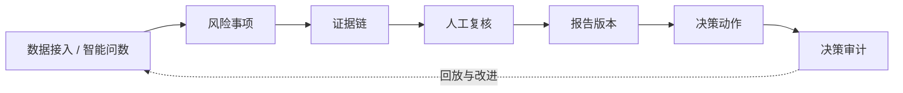

# 问渠 WenQu 风险交付垂直场景验证说明

> 基准日期：2026-09-10
>
> 文档性质：垂直场景验证说明，不是平台路线图。平台进度唯一见 [产品路线图](../ontology-product-roadmap.md)。

## 1. 文档定位

问渠 WenQu 的整体定位是：

> **公司内部使用的 Ontology 驱动企业运营数字孪生与智能决策平台。企业模型、孪生运行时和能力发布中心共同为内置验证 Agent、第三方 Agent 与业务应用提供底座。**

本文只描述“风险报告交付”这一垂直应用如何验证平台价值，不代表整体产品路线。贷款风控是合成技术样例，财税报告是候选内部真实场景；内置验证 Agent 和其他第三方 Agent 都可以复用相同底座。

该场景的验证目标是：平台提供统一业务模型、真实对象状态和受控能力后，垂直 Agent 能否把数据发现推进为经过证据支持、人工复核和审计的业务结果。

## 2. 核心业务闭环

闭环中的最小业务记录如下：

| 记录 | 作用 | 最小追溯要求 |
|---|---|---|
| 数据或问数结果 | 提供指标和异常发现的输入 | 数据源、查询、时间、结果快照、执行 trace |
| 风险事项 | 表达需要解释、复核或处置的问题 | 风险类型、对象、期间、严重度、状态、发现方式 |
| 证据 | 支持或反驳风险事项和报告结论 | 来源、定位信息、快照或摘要、采集时间、完整性标识 |
| 人工复核 | 由有权限的人员确认、驳回或要求补充材料 | 复核人、意见、状态变化、时间、前后值 |
| 报告版本 | 固化某一时点的结论和依据 | 版本号、风险事项快照、证据集合、规则/本体版本、发布人 |
| 决策动作 | 将结论转化为分派、补件、确认、关闭等业务操作 | 动作参数、权限、审批、执行结果、前后状态 |
| 决策审计 | 回答“谁在何时依据什么做了什么” | 全链路关联 ID、操作者、版本、结果、事件哈希和链头锚点 |

## 3. 能力边界

本文按以下层次描述能力，避免把目标状态写成现状：

| 分类 | 范围 |
|---|---|
| 已实现基础 | 智能问数、语义资产、LogicForm 校验与确定性 SQL 编译、分析报告、持久任务；通用 Ontology 对象/关系/动作 CRUD、校验发布、实例运行和动作审计原型 |
| 已实现技术切片 | 风险事项、证据关联、指派复核与禁止自审、不可变报告版本、报告与风险/证据的绑定、贯穿报告与 Ontology 动作的决策审计 |
| 平台已实现基础 | 业务领域归属、内置验证 Agent 适配、企业模型/孪生运行/能力中心入口；不等同于生产级运行时或网关 |
| 后续业务验证 | 真实业务规则、重要性标准、证据充分性、复核职责与权限、正式报告模板、内部数据边界、UAT 和持续使用价值 |

贷款技术切片的代码、迁移、接口、界面、合成资产和自动化回放已完成；它只证明技术契约成立，不代表真实财税规则已经通过业务验证。

## 4. 贷款风控技术切片

先复用现有贷款风控演示域完成技术回归。这样可以验证领域对象、状态流转、证据关联、报告版本和审计契约，不必等待真实业务规则才能推进平台工程，但不得继续把贷款规则扩张当作平台主线。

贷款切片只承担以下技术验证：

- 问数或规则结果能否形成结构化风险事项。
- 已完成问数结果能否按 `trace_id` 一键转换，并自动固化 SQL、结果预览、分析摘要和可选对象快照。
- 风险事项能否关联查询 trace、指标结果、对象快照和附件类证据。
- 复核人能否完成确认、驳回、补件和重新打开等受控状态流转。
- 报告能否绑定风险事项与证据快照，并形成不可变版本。
- 决策动作能否记录权限、参数、前后状态以及使用的模型、规则和 Ontology 版本。
- 全链路能否按报告版本和风险事项回放。

**边界声明：贷款数据、阈值、风险规则和结论均为合成演示，仅用于软件技术验证，不构成真实授信、财务、税务、会计、审计或其他合规意见。**

## 5. 场景验证阶段

### 阶段 A：贷款技术切片

**目标**：在无真实财税规则的前提下，验证“数据/问数 -> 风险事项 -> 证据 -> 人工复核 -> 报告版本 -> 决策动作 -> 审计”的端到端技术契约。

**范围**：

- 复用贷款申请、客户、指标和现有受控动作。
- 使用合成规则生成若干风险事项，不追求业务准确率。
- 建立证据引用、复核状态机、报告版本和审计关联。
- 提供成功、驳回、补件、重新打开和版本重发的自动化回放。

**验收指标**：

- 至少 10 个合成案例完成端到端回放，成功率 100%。
- 风险事项的证据关联完整率 100%，每条证据可定位到来源或结果快照。
- 复核状态变化的操作者、时间、意见和前后状态记录完整率 100%。
- 每个已发布报告版本都绑定风险事项快照、证据集合和决策审计，绑定完整率 100%。
- 已发布版本不可原地修改；修订必须产生新版本，自动化用例通过。
- 演示页面和文档均显示“非真实业务/合规意见”声明。

**阶段状态**：技术实现完成；等待内部财税流程和历史案例进入业务验证。

### 阶段 B：内部财税流程选择

**入口条件**：至少一名承担财税业务确认职责的业务人员和一名承担交付职责的技术人员持续参与。

**目标**：只选择一个高频、资料可得、结果可量化的内部交付流程，替换贷款演示中的对象、规则和报告模板。

候选流程包括月度税务风险复核、季度财务经营分析、税务报告底稿生成或客户财务数据异常核查；本阶段不得同时启动多个流程。

**验收指标**：

- 业务确认人（由业务人员承担）签字确认 1 份决策画布，明确输入、风险事项、证据、角色、动作和输出报告。
- 建立不少于 20 个可脱敏历史案例的清单，并完成数据权限与敏感级别确认。
- 形成首批 10 至 20 条候选规则；每条规则都有来源、负责人、版本和适用边界。
- 确认 1 份真实报告模板和 1 套复核状态流转。
- 完成人工基线测量：平均找数时间、证据整理时间、报告初稿时间、返工次数。

**阶段状态**：等待内部财税团队加入，不阻塞阶段 A。

### 阶段 C：历史案例影子运行

**目标**：系统与顾问原流程并行，不自动替代专业判断，通过历史案例验证效率、可解释性和风险边界。

**验收指标**：

- 不少于 30 个历史案例完成两轮影子运行。
- 系统生成的报告结论人工复核覆盖率 100%，未经复核不得进入正式输出。
- 结论到原始数据或材料的证据可追溯率不低于 95%。
- 系统与专家结论的全部重大差异均形成原因分类和处理记录，记录完整率 100%。
- 相比基线，找数、证据整理和报告初稿的合计人工时间降低至少 30%。
- 未经授权的自动决策动作数量为 0；所有动作均可回放。

达到效率指标但结论质量不稳定时，不得进入内部试运行，应回到规则、证据或复核设计继续迭代。

### 阶段 D：公司内部受控试运行

**目标**：在公司内部一个范围明确的真实流程中持续使用，验证业务价值、运行稳定性和治理边界，而不是把技术演示直接当成生产系统。

**验收指标**：

- 确定 1 个有明确范围、负责人、数据边界和责任边界的内部试点。
- 连续完成至少 4 个交付批次，按期交付率不低于 95%。
- 风险事项、证据、复核、报告版本和决策动作的审计记录完整率 100%。
- 重大质量事故、越权数据访问和未经批准的自动动作均为 0。
- 业务人员和技术人员共同确认量化收益，至少覆盖时间节省、返工减少或风险事项覆盖中的一项。
- 试运行结束形成书面扩围、继续优化或停止决定，不以“继续研究”替代验收结论。

## 6. 产品与工程原则

- 平台主线是企业模型、孪生运行时和能力发布中心；本文只负责用一个场景验证这些底座能力。
- 不要求一次建完整个企业本体；先选一个边界明确的真实领域，形成可复用模型和能力后逐步扩展。
- Agent 消费已发布领域能力，不私有复制本体，也不把物理表字段当作业务语义真相源。
- AI 可以发现、整理和起草，但正式高影响结论必须经过有权限的人工复核。
- 报告版本必须绑定当时的数据、规则、证据、复核和 Ontology 发布版本，不能只保存最终 Markdown。
- 前例或相似案例只能提供参考，不替代法规、专业判断和审批。
- 只有经过真实案例 UAT 的规则才能标记为业务规则；合成规则必须持续标记为演示规则。

## 7. 场景落地顺序

1. 保持贷款技术切片可回归，不继续无业务牵引地扩充贷款规则和对话体验。
2. 按业务与数据接入手册选择一个边界明确的内部风险流程，确认对象、规则、证据和报告模板。
3. 使用已发布的企业模型和能力合同完成内置验证 Agent 与外部调用的一致性验收。
4. 对历史案例执行影子运行，记录系统与人工判断的全部重要差异。
5. 质量、权限和追溯指标通过后，再决定公司内部受控试运行范围。
